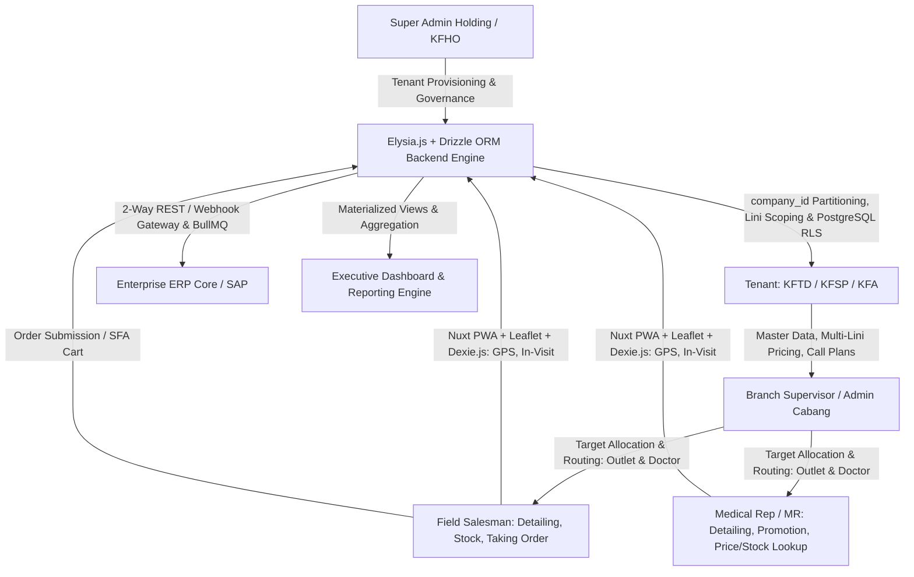
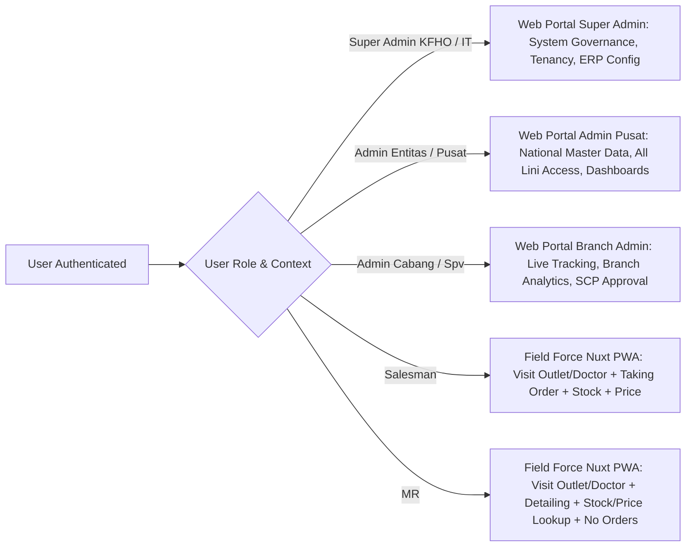
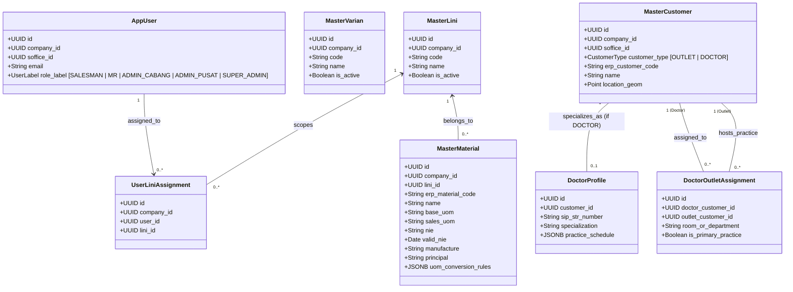
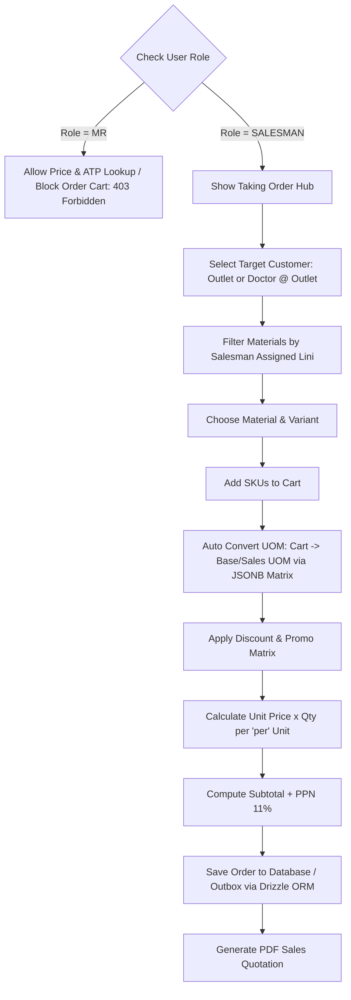
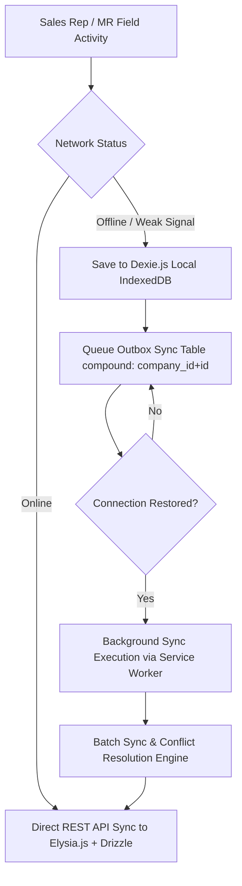
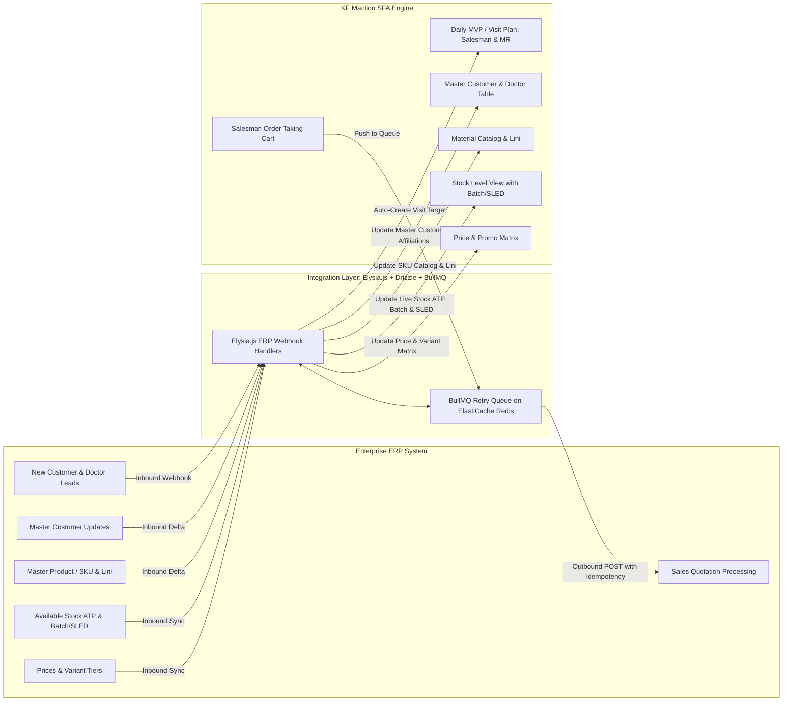
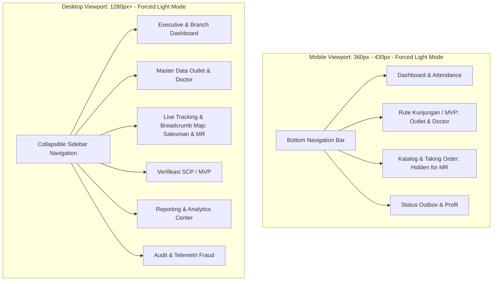
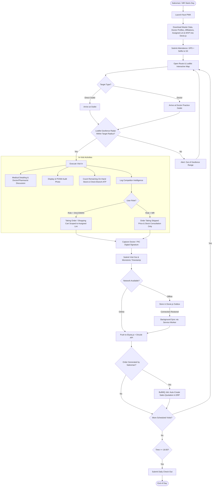

# Product Requirements Document (PRD)

---

## 1. Document Control & Metadata

| Attribute | Details |
| --- | --- |
| **Product Name** | **KF Maction** (*Marketing Activities Monitoring & Sales Force Automation Solution*) |
| **Document Type** | Product Requirements Document (PRD) & Systems Specification |
| **Author** | Business & Systems Analyst Team |
| **Target Organization** | PT Kimia Farma Tbk (Holding KFHO, KFTD, KFSP, KFA, & Subsidiaries) |
| **System URL** | `[https://maction.kimiafarma.co.id](https://maction.kimiafarma.co.id)` (PWA) / `[https://admin.maction.kimiafarma.co.id](https://admin.maction.kimiafarma.co.id)` (Portal) / `[https://api.maction.kimiafarma.co.id](https://api.maction.kimiafarma.co.id)` (Elysia.js Backend) |
| **Status** | Approved Baseline Architecture / Integrated Drizzle ORM Specification |
| **Target Version** | v2.0 (Cloud-Native Multi-Tenant Architecture on AWS) |

---

## 2. Executive Summary & Business Context

### 2.1 Problem Statement

Field sales operations in pharmaceutical distribution and healthcare promotion face significant challenges in tracking field representative activities, ensuring route compliance, recording valid commercial orders, monitoring pharmacy inventory, and gathering on-ground market intelligence. Traditional architectures suffer from poor connectivity in remote fields, delayed order processing, lack of proper logical multi-tenancy across subsidiaries, and vulnerabilities to GPS spoofing/mocking.

### 2.2 Product Vision

**KF Maction v2.0** is an enterprise-grade **Sales Force Automation (SFA) and Field Force Activity Monitoring** platform tailored for the pharmaceutical and consumer healthcare ecosystem. Built on a modern full-stack TypeScript/Bun architecture (**Bun v1.4 + Elysia.js + Drizzle ORM, PostgreSQL 16+ PostGIS, Nuxt 4, Nuxt UI, Nuxt PWA, Dexie.js, and Leaflet**), it provides multi-tenant shared-schema isolation by `company_id`, granular multi-line business scoping per user, doctor-to-multi-outlet affiliations, dual field execution roles (**Salesman** with full SFA order taking vs. **Medical Representative / MR** for promotional detailing without order taking, both visiting Outlets & Doctors), reliable offline execution with IndexedDB synchronization, interactive spatial radar mapping, defense-in-depth anti-spoofing geolocation, dual-layer audit logging, automated ERP integrations, and executive performance reporting running on **AWS Cloud (EC2 with Nginx, RDS PostGIS, ElastiCache Redis, S3)**.



### 2.3 Key Business Objectives & KPIs

* **Visit Compliance & Integrity**: Achieve $\ge 95\%$ adherence to the Monthly Visit Plan (MVP / SCP) across Outlets and Doctors verified via PostGIS geofencing, hardware telemetry, and digital signatures.
* **Zero Field Downtime**: 100% operational availability in offline field conditions using client-side IndexedDB caching (`[company_id+id]`) and background synchronization.
* **Instant Quotation Processing**: Automatically push confirmed Salesman order carts into enterprise ERP systems as Draft Sales Quotations in real time via asynchronous BullMQ queue workers.
* **Type-Safe Data Access**: Guarantee compile-time and runtime type safety using Drizzle ORM integrated with Elysia TypeBox validation across client, server, and database boundaries.
* **Role Boundary Enforcement**: Strictly authorize order-taking functionality exclusively to `SALESMAN` while granting `MR` informational access (Price lists & Stock ATP) for promotional consultation without commercial cart creation across Outlets and Doctors.
* **Granular Product Scoping**: Strict enforcement of product catalog access based on user multi-line assignments (`master_lini`), preventing cross-division unauthorized ordering while maintaining complete visibility for Tenant Admins.
* **Multi-Facility Doctor Intelligence**: Full visibility and tracking of both Salesmen and Medical Representatives engaging doctors across multiple hospital/clinic practice locations.
* **Executive Visibility & Performance**: Sub-second rendering of cross-branch performance KPIs, call-rate realization, product detailing trends, and white-spot coverage analytics.
* **Strict Multi-Tenant Isolation**: Guarantee zero cross-tenant data leakage via PostgreSQL Row-Level Security (RLS) managed through Drizzle ORM session transactions.
* **Anti-Fraud & Audit Compliance**: Provide granular visibility into field anomalies through dual-layer audit trails and graduated soft-rejection responses.

---

## 3. User Personas & Role-Based Access Control (RBAC)



### 3.1 Role Breakdown & Platform Allocation

| Role ID | Role Name | Platform Interface | Target Scope | Key Responsibilities & Module Permissions |
| --- | --- | --- | --- | --- |
| **ROL-01** | **Super Admin Holding** *(KFHO / IT)*<br> | Web Portal (`/admin/super`) | All Entities | Cross-tenant administration; tenant lifecycle provisioning (`companies`); system-wide configuration; ERP integration adapters; global API tokens & rate limit rules. Full bypass access to all materials and lines across all tenants. |
| **ROL-02** | **Admin Entitas / Pusat** *(Tenant HQ)*<br> | Custom Web Portal (`/admin/tenant`) | Tenant HQ | National tenant oversight across assigned `company_id`; master data governance (Users, Lini, Varian, Materials, Prices, Customers, Promotions); soft-delete management; executive KPI dashboard; full access to all business lines within the tenant. |
| **ROL-03** | **Admin Cabang** *(Branch Supervisor)*<br> | Custom Web Portal (`/admin/cabang`) | Branch (`soffice`) | Branch-level oversight (`soffice`); SCP / MVP verification and approval; live salesman & MR GPS tracking; fraud telemetry alert review; branch revenue analytics & report exports across all branch lines. |
| **ROL-04** | **Field Salesman** | Mobile Nuxt PWA (`/app`) | Outlets & Doctors | Daily GPS attendance; offline/online route execution; Leaflet geofence radar; in-visit activities at Outlets & Doctors (Detailing, Stock check, Merchandising, Competitor audit, Digital signatures); **Full access to Price lists, Stock ATP, and Taking Order (Cart / Sales Quotation creation)** scoped to assigned business lines. |
| **ROL-05** | **Medical Representative (MR)** | Mobile Nuxt PWA (`/app`) | Outlets & Doctors | Daily GPS attendance; offline/online route execution; Leaflet geofence radar; in-visit activities at Outlets & Doctors (Medical detailing, Promotional presentation, Competitor intelligence, Outlet stock audit, Doctor/PIC signatures); **Read access to Material Price lists & Available Stock (ATP)** for physician/pharmacist consultation. **Strictly RESTRICTED & BLOCKED from Taking Order / Commercial Cart / Sales Quotation creation.** |

---

## 4. System Architecture & Technical Specifications

graph LR
    subgraph Client Layer
        Web[Desktop Admin Portal: Nuxt 4 + Nuxt UI + Leaflet - Forced Light Mode]
        MobileSales[Salesman PWA: Nuxt 4 + Nuxt UI + Leaflet + Dexie.js - Full SFA Orders]
        MobileMR[MR PWA: Nuxt 4 + Nuxt UI + Leaflet + Dexie.js - Detailing & Price/Stock Lookup]
    end

    subgraph Web Server & Process Layer (AWS EC2 - Ubuntu)
        Nginx[Nginx Reverse Proxy: SSL Termination & Compression]
        NuxtSSR[Nuxt 4 SSR Engine: Node.js / Bun Runtime]
        ElysiaAPI[Elysia.js + Drizzle ORM: Bun v1.4 Engine]
        QueueWorker[Background Queue Worker: BullMQ / Bun]
        Nginx --> NuxtSSR
        Nginx --> ElysiaAPI
    end

    subgraph Managed Cloud Layer (AWS Managed Services)
        RDS[(AWS RDS PostgreSQL 16+ with PostGIS & RLS)]
        ElastiCache[(AWS ElastiCache Redis: Cache, Rate-Limit, Queue)]
        S3Bucket[AWS S3: Photos, Signatures, Attachments]
    end

    subgraph Integration Layer
        ERP[Enterprise ERP / SAP Gateway]
    end

    Client Layer <-->|HTTPS / WSS| Nginx
    ElysiaAPI <-->|Drizzle ORM Connection Pool| RDS
    ElysiaAPI <--> ElastiCache
    ElysiaAPI <--> S3Bucket
    QueueWorker <--> ElastiCache
    QueueWorker <-->|Drizzle ORM| RDS
    QueueWorker <-->|2-Way REST / Webhook Sync| ERP

### 4.1 Technology Stack Details

* **Local Development**: macOS with **OrbStack Docker Compose** (PostgreSQL 16 + PostGIS & Redis), **TablePlus** database client, and **Kiro IDE** workspace.
* **Production Cloud Host**: **AWS EC2** (Ubuntu Linux) running **Nginx** (Reverse proxy, SSL termination, HTTP/2, WebSocket upstreaming) and system process management.
* **Production Database Engine**: **AWS RDS PostgreSQL 16+** with **PostGIS** extension for spatial queries (`ST_DWithin`) and **Row-Level Security (RLS)** for multi-tenant isolation, user multi-line scoping, and RBAC role guards.
* **Database Access & ORM Layer**: **Drizzle ORM (`drizzle-orm` + `drizzle-kit`)** on Bun v1.4, providing type-safe query building, migration generation, native PostGIS SQL integration, and session RLS setters.
* **Production Caching & Queue**: **AWS ElastiCache Redis** for distributed caching, dashboard aggregation caching, Elysia rate-limiting, and BullMQ retry queue engine.
* **Backend Framework**: **Bun v1.4 + Elysia.js** (High-throughput TypeScript HTTP & WebSocket engine, TypeBox validation, JWT guard, RBAC middleware, reporting streams, and transactional database services).
* **Frontend Framework**: **Nuxt 4** (Vue 3, TypeScript).
* **UI Components**: **Nuxt UI** (Tailwind CSS, Radix/Reka Headless primitives) with **Forced Light Mode**.
* **Map & Spatial Visualization**: **Leaflet** + `@vue-leaflet/vue-leaflet` + `leaflet.markercluster` and **Turf.js** for client-side geodesic math.
* **PWA & Offline Core**: **`@vite-pwa/nuxt`** (Service Worker, Workbox Precaching, Background Sync API).
* **Client Local Storage**: **Dexie.js** (IndexedDB wrapper) with compound indexing `[company_id+id]` supporting offline multi-line catalogs, role-based form mutations, and multi-facility doctor mappings.
* **Production Object Storage**: **AWS S3** with lifecycle rules for photos, display audits, and digital signatures.
* **CI/CD Pipeline**: **GitHub Actions** (Lint, Typecheck, Build, and SSH deployment to EC2 with rolling application reload).

---

### 4.2 Modular Monorepo Directory Structure

```text
maction-v2/
├── .github/                            # CI/CD Workflows & Pipeline Automation
│   └── workflows/
│       ├── ci-test.yml                 # PR Quality Gate (Lint, Typecheck, Unit Test)
│       ├── ai-pr-reviewer.yml          # Automated AI Code Reviewer Bot
│       └── deploy-ec2.yml              # Production Deployment (Build & SSH Deploy to AWS EC2)
│
├── .kiro/                              # Spec-Driven AI Development Framework
│   ├── settings/
│   │   └── mcp.json                    # MCP server configuration in this workspace
│   ├── steering/                       # Permanent Architectural Steering
│   │   ├── conventions.md              # Coding styles, architectural patterns, naming standards, and formatting rules
│   │   ├── security.md                 # Mandatory security boundaries, data handling protocols, and constraints (e.g., forbidding hardcoded secrets or unsafe API usage)
│   │   ├── product.md                  # Business Domain, Tenancy Hierarchy & Glossary
│   │   ├── tech.md                     # Bun v1.4, Elysia, Drizzle ORM, Nuxt 4, PostGIS, Dexie.js Rules
│   │   └── structure.md                # Monorepo Path Maps & File Naming Conventions
│   └── specs/                          # Episodic Feature Specifications (EARS)
│       ├── requirements.md             # EARS-Formatted Acceptance Criteria
│       ├── design.md                   # API Contracts, State Models & Local DB Schemas
│       └── tasks.md                    # Sequential Atomic Task Breakdown
│
├── apps/                               # Client Applications Layer
│   ├── web-portal/                     # Nuxt 4 Desktop Admin Portal (HQ & Branch Spv)
│   │   ├── components/                 # Nuxt UI + Leaflet Admin Map & KPI Chart Cards
│   │   ├── composables/                # useApiClient, useTenant, useReporting, useERPConfig
│   │   ├── layouts/                    # Admin Dashboard & Auth Layouts
│   │   ├── pages/                      # /admin/dashboard, /admin/reports, /admin/tracking
│   │   ├── stores/                     # Pinia Tenant & Auth State
│   │   ├── nuxt.config.ts              # Forced Light Mode & Nuxt UI
│   │   └── package.json
│   │
│   └── field-pwa/                      # Nuxt 4 Mobile PWA (Sales Force & MedRep)
│       ├── components/
│       │   ├── map/                    # Leaflet Geofence Radar, Route Polyline
│       │   ├── in-visit/               # Agenda, Display Audit, Stock Audit, Cart Form (Salesman only)
│       │   └── signature/              # HTML5 / Nuxt UI Signature Canvas
│       ├── composables/                # useOfflineDb, useGeofence, useBackgroundSync, useAntiSpoof, useRoleGuard
│       ├── database/                   # Dexie.js Schema with compound index [company_id+id]
│       ├── pages/                      # /app/checkin, /app/visits, /app/orders
│       ├── public/                     # PWA Icons (192x192, 512x512) & Web Manifest
│       ├── stores/                     # Pinia Local Offline Cart & Attendance State
│       ├── nuxt.config.ts              # Forced Light Mode, @vite-pwa/nuxt, Workbox Caching
│       └── package.json
│
├── services/                           # Backend Engine & Microservices
│   └── api-server/                     # Elysia.js + Drizzle ORM Backend on Bun v1.4
│       ├── src/
│       │   ├── config/                 # S3 Client, Redis Connection, Database Pool
│       │   ├── db/                     # Drizzle Schemas, Relations & Migrations
│       │   │   ├── schema/             # Drizzle TypeScript Schema Definitions (auth, customer, material, orders)
│       │   │   ├── relations.ts        # Drizzle Relational Mappings
│       │   │   └── index.ts            # Drizzle DB Instance & RLS Transaction Helper
│       │   ├── modules/                # Modules (Auth, Attendance, Customer, Doctor, Order, Report, Lini)
│       │   ├── middleware/             # Tenant Guard, RBAC Role Guard, Anti-Spoof Velocity, Rate Limiter
│       │   ├── queues/                 # BullMQ ERP Sync & Materialized View Refresh Workers
│       │   └── index.ts                # Elysia Server Entrypoint
│       ├── drizzle.config.ts           # Drizzle Kit Configuration
│       ├── migrations/                 # Drizzle Generated SQL Schema Delta Migrations
│       ├── .env.example                # Redis, RDS PostGIS, & AWS S3 Configurations
│       └── package.json
│
├── packages/                           # Shared Internal Libraries & Types
│   ├── types/                          # Shared TypeScript Definitions (Infer from Drizzle Schema, Customer, Doctor, Role)
│   │   ├── index.ts
│   │   └── package.json
│   └── utils/                          # Shared UOM Calculation, Exporters & Turf Spatial Helpers
│       ├── index.ts
│       └── package.json
│
├── infra/                              # Infrastructure as Code & Deployment Specs
│   ├── docker/                         # Local Development Containers (OrbStack)
│   │   └── docker-compose.yml          # PostgreSQL 16 + PostGIS and Redis
│   ├── nginx/                          # Nginx Production Configuration
│   │   ├── conf.d/
│   │   │   └── maction.conf            # Reverse Proxy, SSL, Compression, Headers
│   │   └── nginx.conf
│   ├── systemd/                        # Systemd Service Units for EC2 (Elysia, Nuxt SSR, Worker)
│   │   ├── maction-api.service
│   │   └── maction-portal.service
│   ├── postgres/                       # PostgreSQL 16+ & PostGIS Init Scripts
│   │   └── init-scripts/
│   │       ├── 01_extensions.sql       # PostGIS, uuid-ossp, Enum Types (with MR, SALESMAN, DOCTOR)
│   │       ├── 02_schema_ddl.sql       # Companies, Customer, Doctor Junction, Lini, Visits, Orders
│   │       ├── 03_reporting_views.sql  # Materialized Views & Analytical Indexes
│   │       ├── 04_audit_tables.sql     # Fraud, ERP, and Lifecycle Audit Schemas
│   │       └── 05_rls_policies.sql     # Row-Level Security Policies (company_id, role & lini scoping)
│   └── aws-s3/                         # AWS S3 Cloud Architecture Config
│       └── bucket-cors-policy.json     # S3 CORS Policy & Lifecycle Rules
│
├── docs/                               # Architecture Specs & Documentation
│   ├── PRD_Maction_v2.md
│   └── architecture_diagrams/
│
├── .gitignore
├── package.json                        # Root Monorepo Scripts
├── pnpm-workspace.yaml                 # Monorepo Workspace Definitions
└── README.md

```

---

## 5. Detailed Functional Requirements (FR)

### 5.1 Module 1: Master Company & Multi-Tenant Management

| Requirement ID | Feature | Description | Priority |
| --- | --- | --- | --- |
| **FR-TEN-01** | **Tenant CRUD & Provisioning** | Super Admin KFHO can register, view, update, and deactivate companies/tenants via the Admin Portal. The Elysia.js backend with Drizzle ORM auto-initializes the logical partition by `company_id`. | High |
| **FR-TEN-02** | **Tenant ERP Gateway Mapping** | Super Admin can configure ERP system types (`SAP_S4HANA`, `SAP_ECC`, `QAD`, `CUSTOM_REST`), endpoint URLs, authentication credentials, and sales organization codes per tenant. | High |
| **FR-TEN-03** | **Drizzle Transactional RLS Enforcement** | Elysia tenant middleware wraps database calls in Drizzle transactions executing `SET LOCAL app.current_company_id`, `SET LOCAL app.current_user_id`, and `SET LOCAL app.current_user_role` to enforce PostgreSQL RLS. | High |
| **FR-TEN-04** | **Tenant Dynamic Branding** | Configurable company logos, document headers for PDF quotations, default tax rates (PPN 11%), and geofence radius defaults per company. | Medium |
| **FR-TEN-05** | **Tenant Kill-Switch** | Deactivating a tenant (`is_active = false`) immediately invalidates active Redis sessions and blocks login for all users under that tenant. | High |

---

### 5.2 Module 2: Authentication, Security & Anti-Spoofing Geolocation

| Requirement ID | Feature | Description | Priority |
| --- | --- | --- | --- |
| **FR-AUTH-01** | **Tenant & Role Scoped JWT** | Elysia.js JWT plugin issues tokens containing `user_id`, `company_id`, `soffice_id`, `role_label` (`SALESMAN` vs `MR`), and array of assigned `lini_ids`. | High |
| **FR-AUTH-02** | **Single Active Session** | The system tracks user IP and session tokens in ElastiCache Redis. Concurrent logins from another device immediately invalidate prior sessions. | High |
| **FR-SEC-GPS-01** | **Mock Location Detection** | Nuxt PWA inspects OS-level provider flags (`location.isMock()`) and enforces accuracy thresholds ($3\text{m} \le \text{accuracy} \le 50\text{m}$). Coordinates failing this check are soft-rejected. | High |
| **FR-SEC-GPS-02** | **Spatial Velocity Check** | Elysia hook calculates kinematic speed between consecutive transactions using PostGIS `ST_DistanceSphere` via Drizzle raw SQL expressions. Speed $>120\text{ km/jam}$ triggers rejection and logs to `audit_fraud_telemetry`. | High |
| **FR-SEC-GPS-03** | **Anti-Clock Tamper Engine** | Offline timestamps are anchored against monotonic hardware clocks (`performance.now()`) with server synchronization delta checks to prevent local clock manipulation. | High |
| **FR-SEC-GPS-04** | **Graduated Fraud Response** | Location anomalies trigger soft rejections (preventing the current action and alerting the user) and log incident telemetry without immediately hard-banning the user account. | High |

---

### 5.3 Module 3: Daily GPS Attendance Management

| Requirement ID | Feature | Description | Priority |
| --- | --- | --- | --- |
| **FR-ATT-01** | **Multi-Category Check-In** | Both Salesmen and MRs can check in under 3 categories: **Office** (Branch office), **Customer** (Direct outlet / Clinic), or **Other** (Remote area). | High |
| **FR-ATT-02** | **PostGIS Geofence Validation** | Computes geodesic proximity using PostGIS `ST_DWithin` via Drizzle SQL between live GPS coordinates and master facility points. | High |
| **FR-ATT-03** | **Selfie Capture & S3 Storage** | Check-in requires mandatory camera capture with automatic client-side timestamp/GPS watermarking, uploaded directly to AWS S3 via pre-signed URLs. | High |
| **FR-ATT-04** | **Attendance Locking Engine** | Field visit execution features are locked until a valid Check-In record exists for the current date (`attendance_date = TODAY`). | High |
| **FR-ATT-05** | **Conditional Checkout Rule** | Check-out is enabled after 16:00 (or shift completion). Field visit actions are locked once checked out for the day. | High |

---

### 5.4 Module 4: Master Hierarchy, Multi-Lini Scoping & Doctor-Outlet Affiliations



| Requirement ID | Feature | Description | Priority |
| --- | --- | --- | --- |
| **FR-MST-01** | **Customer 360 View (Outlet & Doctor)** | Unified master profile covering Outlets (Apotek, Rumah Sakit, Klinik) and Doctors (`customer_type = 'DOCTOR'`) with specialization, practice schedule, and multi-facility affiliations. Both Salesmen and MRs have complete visibility to Outlets and Doctors. | High |
| **FR-MST-02** | **Doctor Multi-Outlet Affiliation (1:N)** | A Doctor entity (`customer_type = 'DOCTOR'`) can be linked to 1 or more Outlets (`customer_type = 'OUTLET'`) via `doctor_outlet_assignments` with room/dept notes and primary practice tags. | High |
| **FR-MST-03** | **Geofence Inheritance for Doctor Visits** | When planning or executing a visit to a Doctor at a specific Outlet (by either Salesman or MR), the geofence validation dynamically inherits the target Outlet's PostGIS coordinates. | High |
| **FR-MST-04** | **Multi-Lini Business Assignment (M:N)** | Sales reps and MRs can be assigned to $\ge 1$ business lines (`user_lini_assignments`). PostgreSQL RLS enforces that users only see materials matching their assigned lines, whereas Admin Tenant/Cabang have complete access. | High |
| **FR-MST-05** | **Material Master Compliance & Supply Chain** | Comprehensive material attributes including BPOM license (`nie`, `valid_nie`), manufacturer, brand principal, separate `base_uom` and `sales_uom`, and JSONB UOM conversion matrix. | High |
| **FR-MST-06** | **Batch & Expiration (SLED) Inventory** | Inventory tracking in `stock_inventory_atp` partitioned by `company_id`, branch `soffice`, `varian_id`, batch number, and shelf life expiration date (`sled`). | High |

---

### 5.5 Module 5: Sales Call Plan (SCP / MVP) & Route Planning

| Requirement ID | Feature | Description | Priority |
| --- | --- | --- | --- |
| **FR-SCP-01** | **Monthly Visit Plan (MVP) Upload** | Branch Admin uploads monthly call schedules per salesman and MR, mapping target dates to Customer Outlets or Doctors (with associated practice Outlet). | High |
| **FR-SCP-02** | **Visit Type Classification** | Visits are classified as **Planned (MVP)** or **Extra (Ad-hoc)** for both Salesmen and MRs. | High |
| **FR-SCP-03** | **Call Rate Target Analytics** | Real-time calculation of Call Plan vs Actual Realization percentage: $\text{Call Rate \%} = \left(\frac{\text{Actual Visits}}{\text{Target MVP Visits}}\right) \times 100\%$ calculated independently for Salesmen and MRs. | High |

---

### 5.6 Module 6: Field Visit Execution & In-Visit Lifecycle

stateDiagram-v2
    [*] --> Scheduled: Monthly Visit Plan (Target: Outlet or Doctor @ Outlet)
    Scheduled --> InVisit: Visit In (Leaflet Geofence Radar Validated on Target Outlet)
    
    state InVisit {
        [*] --> DetailingAgenda: Medical Detailing + Promo Discussion (Photo to S3)
        DetailingAgenda --> CompetitorTracking: Competitor Price + Promo + Photo (S3)
        CompetitorTracking --> MerchandisingAudit: Display & POSM Compliance (S3)
        MerchandisingAudit --> StockAudit: Shelf Stock Verification & Branch ATP Lookup
        
        state RoleCheck <<choice>>
        StockAudit --> RoleCheck
        RoleCheck --> TakingOrder: User is SALESMAN
        RoleCheck --> SkipOrder: User is MR (Price & ATP Consultation Only)
        TakingOrder --> FinalizeVisit
        SkipOrder --> FinalizeVisit
    }
    
    InVisit --> CustomerSignature: Doctor / PIC Digital Signature (Nuxt UI Canvas -> S3)
    CustomerSignature --> Completed: Visit Out (Monotonic Time & Loc Anchored)
    Completed --> [*]

| Requirement ID | Feature | Description | Priority |
| --- | --- | --- | --- |
| **FR-VST-01** | **Visit In Geofence Check** | Salesman and MR must be within the geofence radius ($100\text{m}$) of the targeted Outlet (or the Outlet where the Doctor is currently practicing) to activate **Visit In**. | High |
| **FR-VST-02** | **Concurrent Visit Lock** | User cannot start a new visit at Customer B if a prior visit at Customer A is in `Visit In` status without a completed `Visit Out`. | High |
| **FR-VST-03** | **Agenda & Detailing Logging** | Record meeting notes, medical product detailing topics, materials shared, and mandatory on-site photo proof uploaded to S3. Available for both Salesman and MR. | High |
| **FR-VST-04** | **Competitor Intelligence** | Capture competitor brand name, product name, price points, promo programs, and shelf photos. | Medium |
| **FR-VST-05** | **Merchandising & Planogram Audit** | Audit product display compliance, POSM placement, eye-level shelf presence with before/after photos stored in AWS S3. | Medium |
| **FR-VST-06** | **Outlet Stock on Hand & Branch ATP Check** | Record physical inventory remaining on shelves/storage per SKU (`visit_stock_audits`) and view live branch warehouse ATP stock. Available for both **Salesman** and **MR** across Outlets and Doctors. | High |
| **FR-VST-07** | **Digital Signature & Visit Out** | Doctor or Outlet PIC provides digital signature on Nuxt UI canvas to validate representative's presence before `Visit Out` registration. | High |

---

### 5.7 Module 7: Sales Force Automation (SFA) & Order Taking



| Requirement ID | Feature | Description | Priority |
| --- | --- | --- | --- |
| **FR-SFA-01** | **Salesman Exclusive Order Taking** | Taking Order, Shopping Cart, By-Phone Sales, and Draft Quotation generation are **strictly restricted to users with `role_label = 'SALESMAN'**`. | High |
| **FR-SFA-02** | **MR Pricing & Stock Lookup (No Orders)** | Users with `role_label = 'MR'` are granted full read access to product price lists (`master_price`) and branch stock availability (`stock_inventory_atp`) to facilitate medical consultations, but are strictly forbidden from creating orders (`POST /api/v1/orders` returns `403 Forbidden`). | High |
| **FR-SFA-03** | **Outlet & Doctor Order Association** | Salesmen can create orders for direct Outlets or orders referencing a prescribing Doctor at a specific practicing Outlet facility. | High |
| **FR-SFA-04** | **JSONB Multi-Tier UOM Conversion Engine** | Automatically computes conversions across arbitrary packaging hierarchies to base units using `uom_conversion_rules` JSONB matrices. | High |
| **FR-SFA-05** | **Variant & Unit Quantity Tier Pricing** | Applies pricing based on branch (`soffice`), material variant (`master_varian`), pricing quantity scale (`per`), and `sales_uom`. | High |
| **FR-SFA-06** | **Automated Tax Calculation** | Automatically calculates commercial subtotals, standard VAT (PPN 11%), and estimated final invoice amount. | High |
| **FR-SFA-07** | **Digital Quotation Generation** | Generates digital order summary PDF with tenant branding, customer details, order items, prices, and PIC/Doctor signature saved to S3. | High |

---

### 5.8 Module 8: Native Nuxt PWA & Offline Data Synchronization



| Requirement ID | Feature | Description | Priority |
| --- | --- | --- | --- |
| **FR-PWA-01** | **PWA App Shell & Installation** | Standalone PWA installation on Android/iOS via `@vite-pwa/nuxt` with Web App Manifest and tenant splash screens. | High |
| **FR-PWA-02** | **Static Asset Precaching** | Workbox precaches core UI assets (CSS, JS, Fonts, Icons) using Stale-While-Revalidate caching strategies. | High |
| **FR-PWA-03** | **Compound IndexedDB Caching** | Master data (Customers, Doctor Profiles, Affiliations, Lini Assignments, Materials, Prices, MVPs) cached in Dexie.js with compound index `[company_id+id]`. | High |
| **FR-PWA-04** | **Role-Adaptive Offline Execution** | PWA dynamically adapts in-visit step workflows based on cached role claims (`SALESMAN` includes cart outbox mutation; `MR` skips cart outbox mutation). | High |
| **FR-PWA-05** | **Offline GPS & Monotonic Clock** | Captures device GPS coordinates and local timestamps anchored with `performance.now()` delta checks to prevent clock manipulation. | High |
| **FR-PWA-06** | **Background Auto-Sync Queue** | Offline mutations are stored in a Dexie Outbox queue. The Service Worker Background Sync API pushes transactions to Elysia.js upon reconnection. | High |
| **FR-PWA-07** | **Visual Connectivity & Sync State** | Top navbar shows real-time connection status (*Online*, *Offline*, *Syncing [x items]*) and alerts users to sync conflicts. | High |

---

### 5.9 Module 9: Automated Enterprise ERP Integration



| Requirement ID | Feature | Description | Priority |
| --- | --- | --- | --- |
| **FR-ERP-01** | **New Leads $\rightarrow$ SFA Visit Plan** | New validated customer/doctor leads from ERP automatically trigger the generation of an **Assigned Call Plan / MVP** for the relevant branch Salesman or MR. | High |
| **FR-ERP-02** | **SFA Order $\rightarrow$ ERP Sales Quotation** | When an order is submitted by a Salesman, a BullMQ job on ElastiCache pushes the order payload to the tenant ERP endpoint to create a **Draft Sales Quotation (SQ)**. | High |
| **FR-ERP-03** | **Sync Master Customer & Doctor** | Delta sync updates customer legal names, addresses, doctor specializations, affiliations, credit limits, and active statuses from ERP to `master_customer` and `doctor_profiles`. | High |
| **FR-ERP-04** | **Sync Master Product & Lini** | Syncs SKU codes, descriptions, business lines (`master_lini`), NIE, and UOM conversions from ERP to `master_material`. | High |
| **FR-ERP-05** | **Sync Stock Availability with Batch & SLED** | Syncs unrestricted Available-to-Promise stock quantities, batch numbers, and shelf life expiration dates (`sled`) from ERP branch warehouses. | High |
| **FR-ERP-06** | **Sync Product Pricing & Variants** | Syncs basic and branch-specific price lists, variants (`master_varian`), and `per` units from ERP to `master_price`. | High |
| **FR-ERP-07** | **Sync Master Discount Rules** | Integrates tiered regular, volume, and customer segment discount rules from ERP into the SFA pricing engine. | High |
| **FR-ERP-08** | **Sync Master Promotion Programs** | Syncs active commercial promotions, free goods bundling, and trade promo programs from ERP to SFA. | High |

---

### 5.10 Module 10: Interactive Maps & Spatial Visualization (Leaflet)

| Requirement ID | Feature | Description | Priority |
| --- | --- | --- | --- |
| **FR-MAP-01** | **PWA Geofence Radar View** | Displays an interactive Leaflet radar map (`@vue-leaflet/vue-leaflet`) visualizing target geofence circles (Outlet coordinates for direct visits or Doctor practice locations) and the pulsing marker for Salesman and MR. | High |
| **FR-MAP-02** | **Daily Route Polyline** | Visualizes scheduled daily call routes (MVP) via route polylines with Turf.js geodesic distance calculation and external GPS app deep links. | Medium |
| **FR-MAP-03** | **Location Pin Picker** | Interactive Leaflet pin picker modal to adjust and record precise coordinates during new lead capture or GPS recalibration requests. | High |
| **FR-MAP-04** | **Admin Live Tracking & Breadcrumbs** | Monitoring map on Branch/HQ Web Portal displaying real-time positions of sales reps and MRs with chronological GPS breadcrumb trails. | High |
| **FR-MAP-05** | **Territory & Customer Clustering** | Territory distribution map clustering all outlets and doctor practice locations per branch using `leaflet.markercluster`. | High |
| **FR-MAP-06** | **Admin Visual GPS Recalibration** | Admin map interface allowing visual pin adjustment to update customer master coordinates based on verified field reports. | High |

---

### 5.11 Module 11: Dual-Layer Audit Trails & Fraud Telemetry

| Requirement ID | Feature | Description | Priority |
| --- | --- | --- | --- |
| **FR-AUD-01** | **Application Activity & Delta Audit** | Automated Elysia interceptor recording user mutation events with before-and-after JSON snapshots into `audit_mutation_logs` via Drizzle. | High |
| **FR-AUD-02** | **Fraud Telemetry Logging** | Logging of mock location attempts, abnormal GPS accuracy readings, and speed anomalies into `audit_fraud_telemetry`. | High |
| **FR-AUD-03** | **ERP Sync Audit Trail** | Recording outbound and inbound ERP payloads, HTTP response codes, execution latency, and retry history in `audit_erp_sync_logs`. | High |
| **FR-AUD-04** | **Visit Lifecycle Audit Stream** | Granular timeline recording of timestamps across check-in, arrival, detailing duration, order entry (Salesman only), digital signing, and visit out. | High |

---

### 5.12 Module 12: Executive Dashboard, Territory Analytics & Operational Reporting

```mermaid
flowchart TD
    subgraph Data Sources
        V[Visits & Detailing Logs: Salesman & MR]
        O[Orders & Quotations: Salesman Only]
        A[Attendance & Fraud Telemetry]
        S[Stock & Competitor Audits]
    end

    subgraph Analytics Processing Layer: Elysia.js + Drizzle + PostGIS
        Agg[PostgreSQL Aggregation Engine & Materialized Views]
        Cache[Redis Dashboard Cache: TTL 5-15 mins]
        Agg --> Cache
    end

    subgraph Presentation & Export: Nuxt 4 Admin Portal (Forced Light Mode)
        ExecDash[Executive KPI Cards & Charts]
        BranchDash[Branch Performance & Coverage Grid]
        ExportEngine[Excel / PDF Report Exporter via Elysia Stream]
    end

    V & O & A & S --> Agg
    Cache --> ExecDash & BranchDash
    Agg --> ExportEngine

```

| Requirement ID | Feature | Description | Priority |
| --- | --- | --- | --- |
| **FR-REP-01** | **Executive KPI Summary Dashboard** | Real-time aggregate metric cards on Holding & Tenant level: *Total Effective Calls (EC)*, *Call Rate Realization (% vs MVP target for Salesman vs MR)*, *Total Sales Revenue*, and *Active Field Force Count*. | High |
| **FR-REP-02** | **Role-Segmented Performance Matrix** | Comparative league table and trend graphs ranking branches, Salesmen (by revenue, visits, strike rate), and MRs (by call rate, detailing coverage, doctor reach). | High |
| **FR-REP-03** | **Territory & Coverage White-Spot Analytics** | Spatial Leaflet heatmap highlighting outlet/doctor coverage intensity versus unvisited accounts within assigned geographic territories. | High |
| **FR-REP-04** | **Medical Detailing & Product Trend Report** | Consolidated reporting on detailing topics, products discussed per doctor specialty and business line, and prescription correlation with outlet orders. | Medium |
| **FR-REP-05** | **Competitor Intelligence Digest** | Aggregated view of competitor brand pricing, trade promotions, and market share trends captured during in-visit audits. | Medium |
| **FR-REP-06** | **Granular SFA Order & Quotation Report** | Comprehensive transaction register detailing orders by SKU, variant, volume, discounts, taxes (PPN 11%), sync status, and approving supervisor with multi-variable filtering. | High |
| **FR-REP-07** | **Attendance & Geofence Fraud Incident Report** | Audit logs summarizing check-in punctuality, distance variances from master coordinates, and GPS mock/teleportation incidents per rep. | High |
| **FR-REP-08** | **High-Throughput Export to Excel & PDF** | Elysia.js streaming endpoints allowing export of large datasets into formatted Excel (`.xlsx`) and executive PDF summaries without blocking Bun event loops. | High |

---

## 6. Complete Database Schema (PostgreSQL 16+ PostGIS DDL)

```sql
-- ============================================================================
-- 0. EXTENSIONS & ENUM TYPES
-- ============================================================================
CREATE EXTENSION IF NOT EXISTS "uuid-ossp";
CREATE EXTENSION IF NOT EXISTS "postgis";

CREATE TYPE erp_system_enum AS ENUM ('SAP_S4HANA', 'SAP_ECC', 'QAD', 'CUSTOM_REST');
CREATE TYPE user_label_enum AS ENUM ('SUPER_ADMIN', 'ADMIN_PUSAT', 'ADMIN_CABANG', 'SALESMAN', 'MR');
CREATE TYPE attendance_type_enum AS ENUM ('OFFICE', 'CUSTOMER', 'OTHER');
CREATE TYPE customer_type_enum AS ENUM ('OUTLET', 'DOCTOR', 'COMMUNITY', 'EVENT');
CREATE TYPE visit_type_enum AS ENUM ('PLANNED', 'EXTRA');
CREATE TYPE sync_status_enum AS ENUM ('PENDING', 'SYNCED', 'FAILED');
CREATE TYPE order_status_enum AS ENUM ('DRAFT', 'SUBMITTED', 'SYNCED_ERP', 'REJECTED_ERP', 'CANCELLED');
CREATE TYPE promo_type_enum AS ENUM ('PERCENT_DISCOUNT', 'FIXED_AMOUNT', 'FREE_GOODS', 'BUNDLING');
CREATE TYPE fraud_type_enum AS ENUM ('MOCK_LOCATION', 'VELOCITY_ANOMALY', 'ACCURACY_EXCESS', 'CLOCK_DRIFT');

-- ============================================================================
-- 1. TENANCY, ORGANIZATIONAL HIERARCHY & BUSINESS LINES
-- ============================================================================
CREATE TABLE companies (
    id UUID PRIMARY KEY DEFAULT gen_random_uuid(),
    code VARCHAR(50) UNIQUE NOT NULL,               -- e.g., 'KFTD', 'KFSP', 'KFA'
    name VARCHAR(255) NOT NULL,
    logo_s3_key TEXT,
    erp_system_type erp_system_enum DEFAULT 'SAP_S4HANA',
    erp_endpoint_url TEXT,
    erp_auth_config JSONB,                          -- Encrypted Tokens / Secrets
    erp_company_code VARCHAR(50),                   -- ERP Sales Org / Company Code
    default_tax_rate DECIMAL(5,2) DEFAULT 11.00,
    geofence_radius_meters INT DEFAULT 100,
    is_active BOOLEAN DEFAULT TRUE,
    created_at TIMESTAMPTZ DEFAULT NOW(),
    updated_at TIMESTAMPTZ DEFAULT NOW()
);

CREATE TABLE master_soffice (
    id UUID PRIMARY KEY DEFAULT gen_random_uuid(),
    company_id UUID NOT NULL REFERENCES companies(id) ON DELETE CASCADE,
    code VARCHAR(50) NOT NULL,                      -- e.g., 'JKT01', 'BDG01'
    name VARCHAR(150) NOT NULL,
    address TEXT,
    city VARCHAR(100),
    location_geom GEOMETRY(Point, 4326),            -- Branch PostGIS Coordinates
    is_active BOOLEAN DEFAULT TRUE,
    is_deleted BOOLEAN DEFAULT FALSE,
    deleted_at TIMESTAMPTZ,
    deleted_by UUID,
    created_at TIMESTAMPTZ DEFAULT NOW(),
    updated_at TIMESTAMPTZ DEFAULT NOW()
);
CREATE INDEX idx_soffice_company ON master_soffice(company_id);
CREATE UNIQUE INDEX uq_soffice_active_code ON master_soffice(company_id, code) WHERE deleted_at IS NULL;

-- Master Lini Bisnis (e.g., 'FARMA_ETHICAL', 'FARMA_GENERIK', 'OTC', 'ALKES')
CREATE TABLE master_lini (
    id UUID PRIMARY KEY DEFAULT gen_random_uuid(),
    company_id UUID NOT NULL REFERENCES companies(id) ON DELETE CASCADE,
    code VARCHAR(50) NOT NULL,
    name VARCHAR(150) NOT NULL,
    description TEXT,
    is_active BOOLEAN DEFAULT TRUE,
    is_deleted BOOLEAN DEFAULT FALSE,
    deleted_at TIMESTAMPTZ,
    deleted_by UUID,
    created_at TIMESTAMPTZ DEFAULT NOW(),
    updated_at TIMESTAMPTZ DEFAULT NOW()
);
CREATE INDEX idx_lini_company ON master_lini(company_id, is_active);
CREATE UNIQUE INDEX uq_lini_active_code ON master_lini(company_id, code) WHERE deleted_at IS NULL;

-- Master Varian Produk / Kemasan (e.g., 'REGULAR', 'TENDER', 'EXPORT')
CREATE TABLE master_varian (
    id UUID PRIMARY KEY DEFAULT gen_random_uuid(),
    company_id UUID NOT NULL REFERENCES companies(id) ON DELETE CASCADE,
    code VARCHAR(50) NOT NULL,
    name VARCHAR(150) NOT NULL,
    description TEXT,
    is_active BOOLEAN DEFAULT TRUE,
    is_deleted BOOLEAN DEFAULT FALSE,
    deleted_at TIMESTAMPTZ,
    deleted_by UUID,
    created_at TIMESTAMPTZ DEFAULT NOW(),
    updated_at TIMESTAMPTZ DEFAULT NOW()
);
CREATE INDEX idx_varian_company ON master_varian(company_id, is_active);
CREATE UNIQUE INDEX uq_varian_active_code ON master_varian(company_id, code) WHERE deleted_at IS NULL;

-- ============================================================================
-- 2. USER, RBAC, MULTI-LINI ASSIGNMENT & ATTENDANCE
-- ============================================================================
CREATE TABLE app_users (
    id UUID PRIMARY KEY DEFAULT gen_random_uuid(),
    company_id UUID NOT NULL REFERENCES companies(id) ON DELETE CASCADE,
    soffice_id UUID REFERENCES master_soffice(id),
    email VARCHAR(150) UNIQUE NOT NULL,
    password_hash VARCHAR(255) NOT NULL,
    full_name VARCHAR(150) NOT NULL,
    phone_number VARCHAR(30),
    role_label user_label_enum NOT NULL,            -- 'SUPER_ADMIN', 'ADMIN_PUSAT', 'ADMIN_CABANG', 'SALESMAN', 'MR'
    avatar_s3_key TEXT,
    current_session_ip VARCHAR(45),
    is_active BOOLEAN DEFAULT TRUE,
    is_deleted BOOLEAN DEFAULT FALSE,
    deleted_at TIMESTAMPTZ,
    deleted_by UUID,
    created_at TIMESTAMPTZ DEFAULT NOW(),
    updated_at TIMESTAMPTZ DEFAULT NOW()
);
CREATE INDEX idx_users_company_soffice ON app_users(company_id, soffice_id);
CREATE INDEX idx_users_role ON app_users(company_id, role_label);

-- Junction Table: Multi-Lini Assignment per User (M:N)
CREATE TABLE user_lini_assignments (
    id UUID PRIMARY KEY DEFAULT gen_random_uuid(),
    company_id UUID NOT NULL REFERENCES companies(id) ON DELETE CASCADE,
    user_id UUID NOT NULL REFERENCES app_users(id) ON DELETE CASCADE,
    lini_id UUID NOT NULL REFERENCES master_lini(id) ON DELETE CASCADE,
    is_active BOOLEAN DEFAULT TRUE,
    created_at TIMESTAMPTZ DEFAULT NOW(),
    CONSTRAINT uq_user_lini UNIQUE(company_id, user_id, lini_id)
);
CREATE INDEX idx_user_lini_user ON user_lini_assignments(user_id);
CREATE INDEX idx_user_lini_lookup ON user_lini_assignments(company_id, user_id, lini_id);

CREATE TABLE absensi (
    id UUID PRIMARY KEY DEFAULT gen_random_uuid(),
    company_id UUID NOT NULL REFERENCES companies(id) ON DELETE CASCADE,
    user_id UUID NOT NULL REFERENCES app_users(id) ON DELETE CASCADE,
    attendance_date DATE NOT NULL,
    attendance_type attendance_type_enum NOT NULL,
    check_in_time TIMESTAMPTZ NOT NULL,
    check_in_geom GEOMETRY(Point, 4326) NOT NULL,
    check_in_photo_s3_key TEXT NOT NULL,
    check_in_distance_meters INT,
    check_out_time TIMESTAMPTZ,
    check_out_geom GEOMETRY(Point, 4326),
    check_out_photo_s3_key TEXT,
    notes TEXT,
    created_at TIMESTAMPTZ DEFAULT NOW(),
    CONSTRAINT uq_user_attendance_date UNIQUE(company_id, user_id, attendance_date)
);
CREATE INDEX idx_absensi_company_date ON absensi(company_id, attendance_date);

-- ============================================================================
-- 3. CUSTOMER (OUTLET & DOCTOR) & DOCTOR-OUTLET JUNCTION
-- ============================================================================
CREATE TABLE master_customer (
    id UUID PRIMARY KEY DEFAULT gen_random_uuid(),
    company_id UUID NOT NULL REFERENCES companies(id) ON DELETE CASCADE,
    soffice_id UUID NOT NULL REFERENCES master_soffice(id),
    customer_type customer_type_enum NOT NULL DEFAULT 'OUTLET', -- 'OUTLET' vs 'DOCTOR'
    erp_customer_code VARCHAR(100),
    name VARCHAR(255) NOT NULL,
    customer_group VARCHAR(100),                    -- 'APOTEK', 'RUMAH SAKIT', 'KLINIK', 'DOKTER_SPESIALIS'
    address TEXT,
    city VARCHAR(100),
    location_geom GEOMETRY(Point, 4326),            -- Geolocation Pinpoint (Mandatory for OUTLET)
    credit_limit NUMERIC(15,2) DEFAULT 0,
    credit_term_days INT DEFAULT 30,
    is_active BOOLEAN DEFAULT TRUE,
    is_deleted BOOLEAN DEFAULT FALSE,
    deleted_at TIMESTAMPTZ,
    deleted_by UUID REFERENCES app_users(id),
    created_at TIMESTAMPTZ DEFAULT NOW(),
    updated_at TIMESTAMPTZ DEFAULT NOW()
);
CREATE INDEX idx_customer_company ON master_customer(company_id, customer_type, is_active);
CREATE INDEX idx_customer_spatial ON master_customer USING GIST(location_geom);
CREATE UNIQUE INDEX uq_customer_active_code ON master_customer(company_id, erp_customer_code) WHERE deleted_at IS NULL;

-- Detail Profil Tambahan Dokter (1:1 dengan master_customer WHERE customer_type = 'DOCTOR')
CREATE TABLE doctor_profiles (
    id UUID PRIMARY KEY DEFAULT gen_random_uuid(),
    company_id UUID NOT NULL REFERENCES companies(id) ON DELETE CASCADE,
    customer_id UUID UNIQUE NOT NULL REFERENCES master_customer(id) ON DELETE CASCADE,
    sip_str_number VARCHAR(100),
    specialization VARCHAR(100),                    -- 'Sp.A', 'Sp.OG', 'Sp.PD', 'Dokter Umum'
    sub_specialization VARCHAR(100),
    practice_schedule JSONB,                        -- Hari & jam praktik per outlet
    notes TEXT,
    created_at TIMESTAMPTZ DEFAULT NOW(),
    updated_at TIMESTAMPTZ DEFAULT NOW()
);
CREATE INDEX idx_doctor_profile_specialization ON doctor_profiles(company_id, specialization);

-- Junction Table: Relasi M:N Dokter <---> Fasilitas (Outlet)
CREATE TABLE doctor_outlet_assignments (
    id UUID PRIMARY KEY DEFAULT gen_random_uuid(),
    company_id UUID NOT NULL REFERENCES companies(id) ON DELETE CASCADE,
    doctor_customer_id UUID NOT NULL REFERENCES master_customer(id) ON DELETE CASCADE,
    outlet_customer_id UUID NOT NULL REFERENCES master_customer(id) ON DELETE CASCADE,
    room_or_department VARCHAR(100),                -- 'Poli Anak R. 201', 'Klinik Eksekutif'
    is_primary_practice BOOLEAN DEFAULT FALSE,
    practice_days VARCHAR(50),                     -- 'SENIN, RABU, JUMAT'
    practice_hours_start TIME,
    practice_hours_end TIME,
    is_active BOOLEAN DEFAULT TRUE,
    is_deleted BOOLEAN DEFAULT FALSE,
    deleted_at TIMESTAMPTZ,
    deleted_by UUID REFERENCES app_users(id),
    created_at TIMESTAMPTZ DEFAULT NOW(),
    updated_at TIMESTAMPTZ DEFAULT NOW(),
    CONSTRAINT uq_doctor_outlet UNIQUE(company_id, doctor_customer_id, outlet_customer_id)
);
CREATE INDEX idx_doc_outlet_doc ON doctor_outlet_assignments(doctor_customer_id);
CREATE INDEX idx_doc_outlet_outlet ON doctor_outlet_assignments(outlet_customer_id);

-- PIC Staf Fasilitas / Outlet (Apoteker, Petugas Purchasing, dll)
CREATE TABLE master_pic (
    id UUID PRIMARY KEY DEFAULT gen_random_uuid(),
    company_id UUID NOT NULL REFERENCES companies(id) ON DELETE CASCADE,
    customer_id UUID NOT NULL REFERENCES master_customer(id) ON DELETE CASCADE,
    pic_name VARCHAR(150) NOT NULL,
    position_title VARCHAR(100),
    phone VARCHAR(50),
    is_primary BOOLEAN DEFAULT FALSE,
    is_deleted BOOLEAN DEFAULT FALSE,
    deleted_at TIMESTAMPTZ,
    deleted_by UUID REFERENCES app_users(id),
    created_at TIMESTAMPTZ DEFAULT NOW()
);
CREATE INDEX idx_pic_customer ON master_pic(customer_id);

-- ============================================================================
-- 4. PRODUCT CATALOG, PRICING, VARIANTS & INVENTORY
-- ============================================================================
CREATE TABLE master_material (
    id UUID PRIMARY KEY DEFAULT gen_random_uuid(),
    company_id UUID NOT NULL REFERENCES companies(id) ON DELETE CASCADE,
    erp_material_code VARCHAR(100) NOT NULL,
    name VARCHAR(255) NOT NULL,
    base_uom VARCHAR(20) NOT NULL,                  -- Satuan Dasar e.g., 'PCS' / 'TABLET'
    sales_uom VARCHAR(20) NOT NULL,                 -- Satuan Penjualan e.g., 'BOX'
    nie VARCHAR(100),                               -- Nomor Izin Edar BPOM
    valid_nie DATE,                                 -- Masa Berlaku NIE
    lini_id UUID REFERENCES master_lini(id),        -- Referensi ke master_lini
    manufacture VARCHAR(255),                       -- Manufaktur Pembuat
    principal VARCHAR(255),                         -- Pemilik Brand / Prinsipal
    uom_conversion_rules JSONB NOT NULL,            -- e.g., {"base_uom": "TABLET", "conversions": {"KARTON": 1000, "BOX": 100, "STRIP": 10, "TABLET": 1}}
    is_narcotic_psychotropic BOOLEAN DEFAULT FALSE,
    is_active BOOLEAN DEFAULT TRUE,
    is_deleted BOOLEAN DEFAULT FALSE,
    deleted_at TIMESTAMPTZ,
    deleted_by UUID REFERENCES app_users(id),
    created_at TIMESTAMPTZ DEFAULT NOW(),
    updated_at TIMESTAMPTZ DEFAULT NOW()
);
CREATE INDEX idx_material_company ON master_material(company_id, lini_id, is_active);
CREATE UNIQUE INDEX uq_material_active_code ON master_material(company_id, erp_material_code) WHERE deleted_at IS NULL;

CREATE TABLE master_price (
    id UUID PRIMARY KEY DEFAULT gen_random_uuid(),
    company_id UUID NOT NULL REFERENCES companies(id) ON DELETE CASCADE,
    soffice_id UUID NOT NULL REFERENCES master_soffice(id),
    material_id UUID NOT NULL REFERENCES master_material(id) ON DELETE CASCADE,
    varian_id UUID REFERENCES master_varian(id),    -- Referensi ke master_varian
    price_regular NUMERIC(15,2) NOT NULL,
    price_hja NUMERIC(15,2),
    price_het NUMERIC(15,2),
    per INT NOT NULL DEFAULT 1,                     -- Jumlah Satuan (e.g., per 1 Box)
    sales_uom VARCHAR(20) NOT NULL,                 -- Satuan Harga Penjualan
    valid_from DATE NOT NULL,
    valid_to DATE NOT NULL,
    created_at TIMESTAMPTZ DEFAULT NOW(),
    CONSTRAINT uq_price_branch_mat_var UNIQUE(company_id, soffice_id, material_id, varian_id, valid_from)
);
CREATE INDEX idx_price_lookup ON master_price(soffice_id, material_id, varian_id, valid_from, valid_to);

CREATE TABLE stock_inventory_atp (
    id UUID PRIMARY KEY DEFAULT gen_random_uuid(),
    company_id UUID NOT NULL REFERENCES companies(id) ON DELETE CASCADE,
    soffice_id UUID NOT NULL REFERENCES master_soffice(id),
    material_id UUID NOT NULL REFERENCES master_material(id) ON DELETE CASCADE,
    varian_id UUID REFERENCES master_varian(id),    -- Referensi ke master_varian
    batch VARCHAR(100) NOT NULL,                    -- Nomor Batch Produksi
    sled DATE,                                      -- Shelf Life Expiration Date
    qty_available NUMERIC(12,2) NOT NULL DEFAULT 0, -- Kuantitas Siap Jual (ATP)
    qty_allocated NUMERIC(12,2) NOT NULL DEFAULT 0, -- Kuantitas Ter-alokasi
    stock_value NUMERIC(15,2) DEFAULT 0,            -- Estimasi Nilai Nominal Stok
    sales_uom VARCHAR(20) NOT NULL,
    last_synced_at TIMESTAMPTZ DEFAULT NOW(),
    CONSTRAINT uq_stock_batch UNIQUE(company_id, soffice_id, material_id, varian_id, batch)
);
CREATE INDEX idx_stock_lookup ON stock_inventory_atp(soffice_id, material_id, varian_id, sled);

CREATE TABLE master_promotions (
    id UUID PRIMARY KEY DEFAULT gen_random_uuid(),
    company_id UUID NOT NULL REFERENCES companies(id) ON DELETE CASCADE,
    promo_code VARCHAR(100) NOT NULL,
    promo_name VARCHAR(255) NOT NULL,
    promo_type promo_type_enum NOT NULL,
    discount_percentage DECIMAL(5,2) DEFAULT 0,
    discount_amount NUMERIC(15,2) DEFAULT 0,
    min_order_qty INT DEFAULT 1,
    min_order_uom VARCHAR(20) NOT NULL,              -- Satuan UOM untuk kuantitas minimum order (e.g. 'BOX', 'STRIP')
    free_material_id UUID REFERENCES master_material(id),
    free_material_qty INT DEFAULT 0,
    free_material_uom VARCHAR(20),                   -- Satuan UOM untuk material bonus/gratis (e.g. 'BOX', 'PCS')
    valid_start TIMESTAMPTZ NOT NULL,
    valid_end TIMESTAMPTZ NOT NULL,
    is_active BOOLEAN DEFAULT TRUE,
    is_deleted BOOLEAN DEFAULT FALSE,
    deleted_at TIMESTAMPTZ,
    deleted_by UUID REFERENCES app_users(id),
    created_at TIMESTAMPTZ DEFAULT NOW(),
    updated_at TIMESTAMPTZ DEFAULT NOW()
);
CREATE UNIQUE INDEX uq_promo_active_code ON master_promotions(company_id, promo_code) WHERE deleted_at IS NULL;
CREATE INDEX idx_promotions_company_valid ON master_promotions(company_id, is_active, valid_start, valid_end);

-- ============================================================================
-- 5. CALL PLANS, FIELD VISITS & IN-VISIT LOGS (SALESMAN & MR)
-- ============================================================================
CREATE TABLE visit_plans (
    id UUID PRIMARY KEY DEFAULT gen_random_uuid(),
    company_id UUID NOT NULL REFERENCES companies(id) ON DELETE CASCADE,
    user_id UUID NOT NULL REFERENCES app_users(id),
    customer_id UUID NOT NULL REFERENCES master_customer(id),         -- Target (Outlet atau Dokter)
    outlet_context_id UUID REFERENCES master_customer(id),            -- Outlet tempat praktik jika customer_id = Doctor
    plan_date DATE NOT NULL,
    is_lead_from_erp BOOLEAN DEFAULT FALSE,
    is_approved BOOLEAN DEFAULT TRUE,
    created_at TIMESTAMPTZ DEFAULT NOW(),
    CONSTRAINT uq_user_plan_target UNIQUE(company_id, user_id, customer_id, outlet_context_id, plan_date)
);
CREATE INDEX idx_visit_plan_lookup ON visit_plans(company_id, user_id, plan_date);

CREATE TABLE visits (
    id UUID PRIMARY KEY DEFAULT gen_random_uuid(),
    company_id UUID NOT NULL REFERENCES companies(id) ON DELETE CASCADE,
    user_id UUID NOT NULL REFERENCES app_users(id),                  -- Rep pelaksana (Role: SALESMAN / MR)
    customer_id UUID NOT NULL REFERENCES master_customer(id),         -- Customer yang dikunjungi (Outlet / Dokter)
    outlet_id UUID REFERENCES master_customer(id),                   -- Outlet fisik tempat kunjungan berlangsung
    pic_id UUID REFERENCES master_pic(id),                            -- Staf / Apoteker pendamping (opsional)
    visit_type visit_type_enum DEFAULT 'PLANNED',
    visit_date DATE NOT NULL,
    visit_in_at TIMESTAMPTZ NOT NULL,
    visit_in_geom GEOMETRY(Point, 4326) NOT NULL,
    visit_in_distance_meters INT,
    visit_out_at TIMESTAMPTZ,
    visit_out_geom GEOMETRY(Point, 4326),
    signature_s3_key TEXT,
    notes TEXT,
    sync_status sync_status_enum DEFAULT 'SYNCED',
    created_at TIMESTAMPTZ DEFAULT NOW()
);
CREATE INDEX idx_visits_company_date ON visits(company_id, visit_date);
CREATE INDEX idx_visits_user ON visits(user_id, visit_date);
CREATE INDEX idx_visits_customer_outlet ON visits(customer_id, outlet_id);

CREATE TABLE visit_agendas (
    id UUID PRIMARY KEY DEFAULT gen_random_uuid(),
    visit_id UUID NOT NULL REFERENCES visits(id) ON DELETE CASCADE,
    topic VARCHAR(255) NOT NULL,
    product_discussed_id UUID REFERENCES master_material(id),
    discussion_summary TEXT,
    photo_s3_key TEXT,
    created_at TIMESTAMPTZ DEFAULT NOW()
);

CREATE TABLE visit_stock_audits (
    id UUID PRIMARY KEY DEFAULT gen_random_uuid(),
    visit_id UUID NOT NULL REFERENCES visits(id) ON DELETE CASCADE,
    material_id UUID NOT NULL REFERENCES master_material(id),
    physical_stock_qty INT NOT NULL,
    uom VARCHAR(20) NOT NULL,
    estimated_days_of_stock INT,
    created_at TIMESTAMPTZ DEFAULT NOW()
);

CREATE TABLE visit_competitor_audits (
    id UUID PRIMARY KEY DEFAULT gen_random_uuid(),
    visit_id UUID NOT NULL REFERENCES visits(id) ON DELETE CASCADE,
    competitor_brand VARCHAR(150) NOT NULL,
    competitor_product VARCHAR(150) NOT NULL,
    price_to_pharmacy NUMERIC(15,2),
    consumer_price NUMERIC(15,2),
    active_promo_notes TEXT,
    photo_s3_key TEXT,
    created_at TIMESTAMPTZ DEFAULT NOW()
);

-- ============================================================================
-- 6. ORDERS & SFA TAKING ORDER (SALESMAN ONLY)
-- ============================================================================
CREATE TABLE orders (
    id UUID PRIMARY KEY DEFAULT gen_random_uuid(),
    company_id UUID NOT NULL REFERENCES companies(id) ON DELETE CASCADE,
    soffice_id UUID NOT NULL REFERENCES master_soffice(id),
    user_id UUID NOT NULL REFERENCES app_users(id),                  -- Mandatory: app_users.role_label = 'SALESMAN'
    customer_id UUID NOT NULL REFERENCES master_customer(id),         -- Commercial Ordering Entity (Outlet)
    doctor_customer_id UUID REFERENCES master_customer(id),           -- Prescribing Doctor reference (opsional)
    visit_id UUID REFERENCES visits(id),
    order_number VARCHAR(100) UNIQUE NOT NULL,
    erp_quotation_number VARCHAR(100),
    order_date DATE NOT NULL,
    subtotal_amount NUMERIC(15,2) NOT NULL,
    total_discount_amount NUMERIC(15,2) DEFAULT 0,
    tax_rate DECIMAL(5,2) DEFAULT 11.00,
    tax_amount NUMERIC(15,2) NOT NULL,
    grand_total NUMERIC(15,2) NOT NULL,
    order_status order_status_enum DEFAULT 'DRAFT',
    erp_sync_timestamp TIMESTAMPTZ,
    erp_error_payload JSONB,
    pdf_quotation_s3_key TEXT,
    created_at TIMESTAMPTZ DEFAULT NOW(),
    updated_at TIMESTAMPTZ DEFAULT NOW()
);
CREATE INDEX idx_orders_company_status ON orders(company_id, order_status, order_date);

CREATE TABLE order_items (
    id UUID PRIMARY KEY DEFAULT gen_random_uuid(),
    order_id UUID NOT NULL REFERENCES orders(id) ON DELETE CASCADE,
    material_id UUID NOT NULL REFERENCES master_material(id),
    qty INT NOT NULL,
    sales_uom VARCHAR(20) NOT NULL,
    unit_price NUMERIC(15,2) NOT NULL,
    discount_percentage DECIMAL(5,2) DEFAULT 0,
    discount_amount NUMERIC(15,2) DEFAULT 0,
    subtotal NUMERIC(15,2) NOT NULL,
    promotion_id UUID REFERENCES master_promotions(id),
    is_free_goods BOOLEAN DEFAULT FALSE,
    created_at TIMESTAMPTZ DEFAULT NOW()
);
CREATE INDEX idx_order_items_order ON order_items(order_id);

-- ============================================================================
-- 7. AUDIT TRAILS & FRAUD TELEMETRY
-- ============================================================================
CREATE TABLE audit_mutation_logs (
    id UUID PRIMARY KEY DEFAULT gen_random_uuid(),
    company_id UUID NOT NULL REFERENCES companies(id) ON DELETE CASCADE,
    user_id UUID REFERENCES app_users(id) ON DELETE SET NULL,
    entity_name VARCHAR(100) NOT NULL,
    record_id UUID NOT NULL,
    action_type VARCHAR(20) NOT NULL,              -- 'INSERT', 'UPDATE', 'DELETE'
    old_state JSONB,
    new_state JSONB,
    client_ip VARCHAR(45),
    created_at TIMESTAMPTZ DEFAULT NOW()
);
CREATE INDEX idx_mutation_company ON audit_mutation_logs(company_id, entity_name, created_at);

CREATE TABLE audit_fraud_telemetry (
    id UUID PRIMARY KEY DEFAULT gen_random_uuid(),
    company_id UUID NOT NULL REFERENCES companies(id) ON DELETE CASCADE,
    user_id UUID NOT NULL REFERENCES app_users(id) ON DELETE CASCADE,
    fraud_type fraud_type_enum NOT NULL,
    claimed_geom GEOMETRY(Point, 4326),
    accuracy_meters NUMERIC(6,2),
    calculated_speed_kmh NUMERIC(6,2),
    device_info JSONB,
    payload_snapshot JSONB,
    created_at TIMESTAMPTZ DEFAULT NOW()
);
CREATE INDEX idx_fraud_company_date ON audit_fraud_telemetry(company_id, created_at);

CREATE TABLE audit_erp_sync_logs (
    id UUID PRIMARY KEY DEFAULT gen_random_uuid(),
    company_id UUID NOT NULL REFERENCES companies(id) ON DELETE CASCADE,
    order_id UUID REFERENCES orders(id) ON DELETE SET NULL,
    sync_direction VARCHAR(20) NOT NULL,           -- 'OUTBOUND_ORDER', 'INBOUND_MASTER'
    endpoint_url TEXT NOT NULL,
    request_payload JSONB,
    response_payload JSONB,
    http_status INT,
    latency_ms INT,
    retry_count INT DEFAULT 0,
    is_success BOOLEAN NOT NULL,
    error_message TEXT,
    created_at TIMESTAMPTZ DEFAULT NOW()
);
CREATE INDEX idx_erp_logs_company ON audit_erp_sync_logs(company_id, is_success, created_at);

-- ============================================================================
-- 8. MATERIALIZED VIEWS & ANALYTICAL INDEXES (REPORTING ENGINE)
-- ============================================================================
CREATE INDEX idx_orders_reporting ON orders(company_id, soffice_id, order_date, order_status);
CREATE INDEX idx_visits_reporting ON visits(company_id, user_id, visit_date, visit_type);

CREATE MATERIALIZED VIEW mv_daily_branch_performance AS
SELECT 
    v.company_id,
    u.soffice_id,
    v.visit_date,
    COUNT(DISTINCT v.id) AS total_visits,
    COUNT(DISTINCT CASE WHEN v.visit_type = 'PLANNED' THEN v.id END) AS planned_visits,
    COUNT(DISTINCT CASE WHEN u.role_label = 'SALESMAN' THEN v.id END) AS salesman_visits,
    COUNT(DISTINCT CASE WHEN u.role_label = 'MR' THEN v.id END) AS mr_visits,
    COUNT(DISTINCT o.id) AS total_orders,
    COALESCE(SUM(o.grand_total), 0) AS total_order_value
FROM visits v
JOIN app_users u ON v.user_id = u.id
LEFT JOIN orders o ON o.visit_id = v.id
GROUP BY v.company_id, u.soffice_id, v.visit_date;

CREATE UNIQUE INDEX uq_mv_branch_perf ON mv_daily_branch_performance(company_id, soffice_id, visit_date);

-- ============================================================================
-- 9. ROW LEVEL SECURITY (RLS) POLICIES
-- ============================================================================
ALTER TABLE master_soffice ENABLE ROW LEVEL SECURITY;
ALTER TABLE master_lini ENABLE ROW LEVEL SECURITY;
ALTER TABLE master_varian ENABLE ROW LEVEL SECURITY;
ALTER TABLE app_users ENABLE ROW LEVEL SECURITY;
ALTER TABLE user_lini_assignments ENABLE ROW LEVEL SECURITY;
ALTER TABLE master_customer ENABLE ROW LEVEL SECURITY;
ALTER TABLE doctor_profiles ENABLE ROW LEVEL SECURITY;
ALTER TABLE doctor_outlet_assignments ENABLE ROW LEVEL SECURITY;
ALTER TABLE master_pic ENABLE ROW LEVEL SECURITY;
ALTER TABLE master_material ENABLE ROW LEVEL SECURITY;
ALTER TABLE master_price ENABLE ROW LEVEL SECURITY;
ALTER TABLE stock_inventory_atp ENABLE ROW LEVEL SECURITY;
ALTER TABLE master_promotions ENABLE ROW LEVEL SECURITY;
ALTER TABLE visit_plans ENABLE ROW LEVEL SECURITY;
ALTER TABLE visits ENABLE ROW LEVEL SECURITY;
ALTER TABLE orders ENABLE ROW LEVEL SECURITY;
ALTER TABLE audit_mutation_logs ENABLE ROW LEVEL SECURITY;
ALTER TABLE audit_fraud_telemetry ENABLE ROW LEVEL SECURITY;
ALTER TABLE audit_erp_sync_logs ENABLE ROW LEVEL SECURITY;

CREATE POLICY tenant_isolation_soffice ON master_soffice
    FOR ALL USING (company_id = NULLIF(current_setting('app.current_company_id', true), '')::uuid);

CREATE POLICY tenant_isolation_lini ON master_lini
    FOR ALL USING (company_id = NULLIF(current_setting('app.current_company_id', true), '')::uuid);

CREATE POLICY tenant_isolation_varian ON master_varian
    FOR ALL USING (company_id = NULLIF(current_setting('app.current_company_id', true), '')::uuid);

CREATE POLICY tenant_isolation_users ON app_users
    FOR ALL USING (company_id = NULLIF(current_setting('app.current_company_id', true), '')::uuid);

CREATE POLICY tenant_isolation_user_lini ON user_lini_assignments
    FOR ALL USING (company_id = NULLIF(current_setting('app.current_company_id', true), '')::uuid);

CREATE POLICY tenant_isolation_customer ON master_customer
    FOR ALL USING (company_id = NULLIF(current_setting('app.current_company_id', true), '')::uuid);

CREATE POLICY tenant_isolation_doctor_profiles ON doctor_profiles
    FOR ALL USING (company_id = NULLIF(current_setting('app.current_company_id', true), '')::uuid);

CREATE POLICY tenant_isolation_doctor_outlets ON doctor_outlet_assignments
    FOR ALL USING (company_id = NULLIF(current_setting('app.current_company_id', true), '')::uuid);

CREATE POLICY tenant_isolation_pic ON master_pic
    FOR ALL USING (company_id = NULLIF(current_setting('app.current_company_id', true), '')::uuid);

CREATE POLICY material_access_policy ON master_material
    FOR ALL USING (
        current_setting('app.current_user_role', true) = 'SUPER_ADMIN'
        OR (
            company_id = NULLIF(current_setting('app.current_company_id', true), '')::uuid
            AND (
                current_setting('app.current_user_role', true) IN ('ADMIN_PUSAT', 'ADMIN_CABANG')
                OR
                lini_id IN (
                    SELECT ula.lini_id 
                    FROM user_lini_assignments ula
                    WHERE ula.user_id = NULLIF(current_setting('app.current_user_id', true), '')::uuid
                      AND ula.company_id = master_material.company_id
                      AND ula.is_active = TRUE
                )
            )
        )
    );

CREATE POLICY tenant_isolation_price ON master_price
    FOR ALL USING (company_id = NULLIF(current_setting('app.current_company_id', true), '')::uuid);

CREATE POLICY tenant_isolation_stock ON stock_inventory_atp
    FOR ALL USING (company_id = NULLIF(current_setting('app.current_company_id', true), '')::uuid);

CREATE POLICY tenant_isolation_promotions ON master_promotions
    FOR ALL USING (company_id = NULLIF(current_setting('app.current_company_id', true), '')::uuid);

CREATE POLICY tenant_isolation_plans ON visit_plans
    FOR ALL USING (company_id = NULLIF(current_setting('app.current_company_id', true), '')::uuid);

CREATE POLICY tenant_isolation_visits ON visits
    FOR ALL USING (company_id = NULLIF(current_setting('app.current_company_id', true), '')::uuid);

CREATE POLICY tenant_isolation_orders ON orders
    FOR ALL USING (
        company_id = NULLIF(current_setting('app.current_company_id', true), '')::uuid
        AND current_setting('app.current_user_role', true) IN ('SUPER_ADMIN', 'ADMIN_PUSAT', 'ADMIN_CABANG', 'SALESMAN')
    );

CREATE POLICY tenant_isolation_mutation ON audit_mutation_logs
    FOR ALL USING (company_id = NULLIF(current_setting('app.current_company_id', true), '')::uuid);

CREATE POLICY tenant_isolation_fraud ON audit_fraud_telemetry
    FOR ALL USING (company_id = NULLIF(current_setting('app.current_company_id', true), '')::uuid);

CREATE POLICY tenant_isolation_erp_logs ON audit_erp_sync_logs
    FOR ALL USING (company_id = NULLIF(current_setting('app.current_company_id', true), '')::uuid);

```

---

## 7. Backend Drizzle ORM Schema Specification

```typescript
// services/api-server/src/db/schema/index.ts
import { 
  pgTable, uuid, varchar, text, numeric, integer, 
  boolean, timestamp, date, jsonb, customType, pgEnum, uniqueIndex, index
} from 'drizzle-orm/pg-core';
import { sql, relations } from 'drizzle-orm';

// ============================================================================
// 0. CUSTOM POSTGIS TYPE & ENUMS
// ============================================================================
export const geometryPoint = customType<{ data: { lat: number; lng: number }; driverData: string }>({
  dataType() {
    return 'geometry(Point, 4326)';
  },
  toDriver(value) {
    return `SRID=4326;POINT(${value.lng} ${value.lat})`;
  },
  fromDriver(value) {
    const matches = value.match(/POINT\((.+) (.+)\)/);
    return matches ? { lng: parseFloat(matches[1]), lat: parseFloat(matches[2]) } : { lat: 0, lng: 0 };
  },
});

export const erpSystemEnum = pgEnum('erp_system_enum', ['SAP_S4HANA', 'SAP_ECC', 'QAD', 'CUSTOM_REST']);
export const userLabelEnum = pgEnum('user_label_enum', ['SUPER_ADMIN', 'ADMIN_PUSAT', 'ADMIN_CABANG', 'SALESMAN', 'MR']);
export const attendanceTypeEnum = pgEnum('attendance_type_enum', ['OFFICE', 'CUSTOMER', 'OTHER']);
export const customerTypeEnum = pgEnum('customer_type_enum', ['OUTLET', 'DOCTOR', 'COMMUNITY', 'EVENT']);
export const visitTypeEnum = pgEnum('visit_type_enum', ['PLANNED', 'EXTRA']);
export const syncStatusEnum = pgEnum('sync_status_enum', ['PENDING', 'SYNCED', 'FAILED']);
export const orderStatusEnum = pgEnum('order_status_enum', ['DRAFT', 'SUBMITTED', 'SYNCED_ERP', 'REJECTED_ERP', 'CANCELLED']);
export const promoTypeEnum = pgEnum('promo_type_enum', ['PERCENT_DISCOUNT', 'FIXED_AMOUNT', 'FREE_GOODS', 'BUNDLING']);
export const fraudTypeEnum = pgEnum('fraud_type_enum', ['MOCK_LOCATION', 'VELOCITY_ANOMALY', 'ACCURACY_EXCESS', 'CLOCK_DRIFT']);

// ============================================================================
// 1. TENANCY, ORGANIZATIONAL HIERARCHY & BUSINESS LINES
// ============================================================================
export const companies = pgTable('companies', {
  id: uuid('id').defaultRandom().primaryKey(),
  code: varchar('code', { length: 50 }).unique().notNull(),
  name: varchar('name', { length: 255 }).notNull(),
  logoS3Key: text('logo_s3_key'),
  erpSystemType: erpSystemEnum('erp_system_type').default('SAP_S4HANA'),
  erpEndpointUrl: text('erp_endpoint_url'),
  erpAuthConfig: jsonb('erp_auth_config'),
  erpCompanyCode: varchar('erp_company_code', { length: 50 }),
  defaultTaxRate: numeric('default_tax_rate', { precision: 5, scale: 2 }).default('11.00'),
  geofenceRadiusMeters: integer('geofence_radius_meters').default(100),
  isActive: boolean('is_active').default(true),
  createdAt: timestamp('created_at', { withTimezone: true }).defaultNow(),
  updatedAt: timestamp('updated_at', { withTimezone: true }).defaultNow(),
});

export const masterSoffice = pgTable('master_soffice', {
  id: uuid('id').defaultRandom().primaryKey(),
  companyId: uuid('company_id').notNull().references(() => companies.id, { onDelete: 'cascade' }),
  code: varchar('code', { length: 50 }).notNull(),
  name: varchar('name', { length: 150 }).notNull(),
  address: text('address'),
  city: varchar('city', { length: 100 }),
  locationGeom: geometryPoint('location_geom'),
  isActive: boolean('is_active').default(true),
  isDeleted: boolean('is_deleted').default(false),
  deletedAt: timestamp('deleted_at', { withTimezone: true }),
  deletedBy: uuid('deleted_by'),
  createdAt: timestamp('created_at', { withTimezone: true }).defaultNow(),
  updatedAt: timestamp('updated_at', { withTimezone: true }).defaultNow(),
}, (table) => ({
  companyIdx: index('idx_soffice_company').on(table.companyId),
  uqActiveCode: uniqueIndex('uq_soffice_active_code').on(table.companyId, table.code).where(sql`deleted_at IS NULL`),
}));

export const masterLini = pgTable('master_lini', {
  id: uuid('id').defaultRandom().primaryKey(),
  companyId: uuid('company_id').notNull().references(() => companies.id, { onDelete: 'cascade' }),
  code: varchar('code', { length: 50 }).notNull(),
  name: varchar('name', { length: 150 }).notNull(),
  description: text('description'),
  isActive: boolean('is_active').default(true),
  isDeleted: boolean('is_deleted').default(false),
  deletedAt: timestamp('deleted_at', { withTimezone: true }),
  deletedBy: uuid('deleted_by'),
  createdAt: timestamp('created_at', { withTimezone: true }).defaultNow(),
  updatedAt: timestamp('updated_at', { withTimezone: true }).defaultNow(),
}, (table) => ({
  companyIdx: index('idx_lini_company').on(table.companyId, table.isActive),
  uqActiveCode: uniqueIndex('uq_lini_active_code').on(table.companyId, table.code).where(sql`deleted_at IS NULL`),
}));

export const masterVarian = pgTable('master_varian', {
  id: uuid('id').defaultRandom().primaryKey(),
  companyId: uuid('company_id').notNull().references(() => companies.id, { onDelete: 'cascade' }),
  code: varchar('code', { length: 50 }).notNull(),
  name: varchar('name', { length: 150 }).notNull(),
  description: text('description'),
  isActive: boolean('is_active').default(true),
  isDeleted: boolean('is_deleted').default(false),
  deletedAt: timestamp('deleted_at', { withTimezone: true }),
  deletedBy: uuid('deleted_by'),
  createdAt: timestamp('created_at', { withTimezone: true }).defaultNow(),
  updatedAt: timestamp('updated_at', { withTimezone: true }).defaultNow(),
}, (table) => ({
  companyIdx: index('idx_varian_company').on(table.companyId, table.isActive),
  uqActiveCode: uniqueIndex('uq_varian_active_code').on(table.companyId, table.code).where(sql`deleted_at IS NULL`),
}));

// ============================================================================
// 2. USER, RBAC, MULTI-LINI ASSIGNMENT & ATTENDANCE
// ============================================================================
export const appUsers = pgTable('app_users', {
  id: uuid('id').defaultRandom().primaryKey(),
  companyId: uuid('company_id').notNull().references(() => companies.id, { onDelete: 'cascade' }),
  sofficeId: uuid('soffice_id').references(() => masterSoffice.id),
  email: varchar('email', { length: 150 }).unique().notNull(),
  passwordHash: varchar('password_hash', { length: 255 }).notNull(),
  fullName: varchar('full_name', { length: 150 }).notNull(),
  phoneNumber: varchar('phone_number', { length: 30 }),
  roleLabel: userLabelEnum('role_label').notNull(),
  avatarS3Key: text('avatar_s3_key'),
  currentSessionIp: varchar('current_session_ip', { length: 45 }),
  isActive: boolean('is_active').default(true),
  isDeleted: boolean('is_deleted').default(false),
  deletedAt: timestamp('deleted_at', { withTimezone: true }),
  deletedBy: uuid('deleted_by'),
  createdAt: timestamp('created_at', { withTimezone: true }).defaultNow(),
  updatedAt: timestamp('updated_at', { withTimezone: true }).defaultNow(),
}, (table) => ({
  companySofficeIdx: index('idx_users_company_soffice').on(table.companyId, table.sofficeId),
  roleIdx: index('idx_users_role').on(table.companyId, table.roleLabel),
}));

export const userLiniAssignments = pgTable('user_lini_assignments', {
  id: uuid('id').defaultRandom().primaryKey(),
  companyId: uuid('company_id').notNull().references(() => companies.id, { onDelete: 'cascade' }),
  userId: uuid('user_id').notNull().references(() => appUsers.id, { onDelete: 'cascade' }),
  liniId: uuid('lini_id').notNull().references(() => masterLini.id, { onDelete: 'cascade' }),
  isActive: boolean('is_active').default(true),
  createdAt: timestamp('created_at', { withTimezone: true }).defaultNow(),
}, (table) => ({
  userIdx: index('idx_user_lini_user').on(table.userId),
  lookupIdx: index('idx_user_lini_lookup').on(table.companyId, table.userId, table.liniId),
  uqUserLini: uniqueIndex('uq_user_lini').on(table.companyId, table.userId, table.liniId),
}));

export const absensi = pgTable('absensi', {
  id: uuid('id').defaultRandom().primaryKey(),
  companyId: uuid('company_id').notNull().references(() => companies.id, { onDelete: 'cascade' }),
  userId: uuid('user_id').notNull().references(() => appUsers.id, { onDelete: 'cascade' }),
  attendanceDate: date('attendance_date').notNull(),
  attendanceType: attendanceTypeEnum('attendance_type').notNull(),
  checkInTime: timestamp('check_in_time', { withTimezone: true }).notNull(),
  checkInGeom: geometryPoint('check_in_geom').notNull(),
  checkInPhotoS3Key: text('check_in_photo_s3_key').notNull(),
  checkInDistanceMeters: integer('check_in_distance_meters'),
  checkOutTime: timestamp('check_out_time', { withTimezone: true }),
  checkOutGeom: geometryPoint('check_out_geom'),
  checkOutPhotoS3Key: text('check_out_photo_s3_key'),
  notes: text('notes'),
  createdAt: timestamp('created_at', { withTimezone: true }).defaultNow(),
}, (table) => ({
  companyDateIdx: index('idx_absensi_company_date').on(table.companyId, table.attendanceDate),
  uqUserAttendanceDate: uniqueIndex('uq_user_attendance_date').on(table.companyId, table.userId, table.attendanceDate),
}));

// ============================================================================
// 3. CUSTOMER (OUTLET & DOCTOR) & DOCTOR-OUTLET JUNCTION
// ============================================================================
export const masterCustomer = pgTable('master_customer', {
  id: uuid('id').defaultRandom().primaryKey(),
  companyId: uuid('company_id').notNull().references(() => companies.id, { onDelete: 'cascade' }),
  sofficeId: uuid('soffice_id').notNull().references(() => masterSoffice.id),
  customerType: customerTypeEnum('customer_type').default('OUTLET').notNull(),
  erpCustomerCode: varchar('erp_customer_code', { length: 100 }),
  name: varchar('name', { length: 255 }).notNull(),
  customerGroup: varchar('customer_group', { length: 100 }),
  address: text('address'),
  city: varchar('city', { length: 100 }),
  locationGeom: geometryPoint('location_geom'),
  creditLimit: numeric('credit_limit', { precision: 15, scale: 2 }).default('0'),
  creditTermDays: integer('credit_term_days').default(30),
  isActive: boolean('is_active').default(true),
  isDeleted: boolean('is_deleted').default(false),
  deletedAt: timestamp('deleted_at', { withTimezone: true }),
  deletedBy: uuid('deleted_by').references(() => appUsers.id),
  createdAt: timestamp('created_at', { withTimezone: true }).defaultNow(),
  updatedAt: timestamp('updated_at', { withTimezone: true }).defaultNow(),
}, (table) => ({
  companyTypeIdx: index('idx_customer_company').on(table.companyId, table.customerType, table.isActive),
  uqActiveCode: uniqueIndex('uq_customer_active_code').on(table.companyId, table.erpCustomerCode).where(sql`deleted_at IS NULL`),
}));

export const doctorProfiles = pgTable('doctor_profiles', {
  id: uuid('id').defaultRandom().primaryKey(),
  companyId: uuid('company_id').notNull().references(() => companies.id, { onDelete: 'cascade' }),
  customerId: uuid('customer_id').unique().notNull().references(() => masterCustomer.id, { onDelete: 'cascade' }),
  sipStrNumber: varchar('sip_str_number', { length: 100 }),
  specialization: varchar('specialization', { length: 100 }),
  subSpecialization: varchar('sub_specialization', { length: 100 }),
  practiceSchedule: jsonb('practice_schedule'),
  notes: text('notes'),
  createdAt: timestamp('created_at', { withTimezone: true }).defaultNow(),
  updatedAt: timestamp('updated_at', { withTimezone: true }).defaultNow(),
}, (table) => ({
  specializationIdx: index('idx_doctor_profile_specialization').on(table.companyId, table.specialization),
}));

export const doctorOutletAssignments = pgTable('doctor_outlet_assignments', {
  id: uuid('id').defaultRandom().primaryKey(),
  companyId: uuid('company_id').notNull().references(() => companies.id, { onDelete: 'cascade' }),
  doctorCustomerId: uuid('doctor_customer_id').notNull().references(() => masterCustomer.id, { onDelete: 'cascade' }),
  outletCustomerId: uuid('outlet_customer_id').notNull().references(() => masterCustomer.id, { onDelete: 'cascade' }),
  roomOrDepartment: varchar('room_or_department', { length: 100 }),
  isPrimaryPractice: boolean('is_primary_practice').default(false),
  practiceDays: varchar('practice_days', { length: 50 }),
  practiceHoursStart: varchar('practice_hours_start', { length: 10 }),
  practiceHoursEnd: varchar('practice_hours_end', { length: 10 }),
  isActive: boolean('is_active').default(true),
  isDeleted: boolean('is_deleted').default(false),
  deletedAt: timestamp('deleted_at', { withTimezone: true }),
  deletedBy: uuid('deleted_by').references(() => appUsers.id),
  createdAt: timestamp('created_at', { withTimezone: true }).defaultNow(),
  updatedAt: timestamp('updated_at', { withTimezone: true }).defaultNow(),
}, (table) => ({
  docIdx: index('idx_doc_outlet_doc').on(table.doctorCustomerId),
  outletIdx: index('idx_doc_outlet_outlet').on(table.outletCustomerId),
  uqDoctorOutlet: uniqueIndex('uq_doctor_outlet').on(table.companyId, table.doctorCustomerId, table.outletCustomerId),
}));

export const masterPic = pgTable('master_pic', {
  id: uuid('id').defaultRandom().primaryKey(),
  companyId: uuid('company_id').notNull().references(() => companies.id, { onDelete: 'cascade' }),
  customerId: uuid('customer_id').notNull().references(() => masterCustomer.id, { onDelete: 'cascade' }),
  picName: varchar('pic_name', { length: 150 }).notNull(),
  positionTitle: varchar('position_title', { length: 100 }),
  phone: varchar('phone', { length: 50 }),
  isPrimary: boolean('is_primary').default(false),
  isDeleted: boolean('is_deleted').default(false),
  deletedAt: timestamp('deleted_at', { withTimezone: true }),
  deletedBy: uuid('deleted_by').references(() => appUsers.id),
  createdAt: timestamp('created_at', { withTimezone: true }).defaultNow(),
}, (table) => ({
  customerIdx: index('idx_pic_customer').on(table.customerId),
}));

// ============================================================================
// 4. PRODUCT CATALOG, PRICING, VARIANTS & INVENTORY
// ============================================================================
export const masterMaterial = pgTable('master_material', {
  id: uuid('id').defaultRandom().primaryKey(),
  companyId: uuid('company_id').notNull().references(() => companies.id, { onDelete: 'cascade' }),
  erpMaterialCode: varchar('erp_material_code', { length: 100 }).notNull(),
  name: varchar('name', { length: 255 }).notNull(),
  baseUom: varchar('base_uom', { length: 20 }).notNull(),
  salesUom: varchar('sales_uom', { length: 20 }).notNull(),
  nie: varchar('nie', { length: 100 }),
  validNie: date('valid_nie'),
  liniId: uuid('lini_id').references(() => masterLini.id),
  manufacture: varchar('manufacture', { length: 255 }),
  principal: varchar('principal', { length: 255 }),
  uomConversionRules: jsonb('uom_conversion_rules').notNull(),
  isNarcoticPsychotropic: boolean('is_narcotic_psychotropic').default(false),
  isActive: boolean('is_active').default(true),
  isDeleted: boolean('is_deleted').default(false),
  deletedAt: timestamp('deleted_at', { withTimezone: true }),
  deletedBy: uuid('deleted_by').references(() => appUsers.id),
  createdAt: timestamp('created_at', { withTimezone: true }).defaultNow(),
  updatedAt: timestamp('updated_at', { withTimezone: true }).defaultNow(),
}, (table) => ({
  companyLiniIdx: index('idx_material_company').on(table.companyId, table.liniId, table.isActive),
  uqActiveCode: uniqueIndex('uq_material_active_code').on(table.companyId, table.erpMaterialCode).where(sql`deleted_at IS NULL`),
}));

export const masterPrice = pgTable('master_price', {
  id: uuid('id').defaultRandom().primaryKey(),
  companyId: uuid('company_id').notNull().references(() => companies.id, { onDelete: 'cascade' }),
  sofficeId: uuid('soffice_id').notNull().references(() => masterSoffice.id),
  materialId: uuid('material_id').notNull().references(() => masterMaterial.id, { onDelete: 'cascade' }),
  varianId: uuid('varian_id').references(() => masterVarian.id),
  priceRegular: numeric('price_regular', { precision: 15, scale: 2 }).notNull(),
  priceHja: numeric('price_hja', { precision: 15, scale: 2 }),
  priceHet: numeric('price_het', { precision: 15, scale: 2 }),
  per: integer('per').default(1).notNull(),
  salesUom: varchar('sales_uom', { length: 20 }).notNull(),
  validFrom: date('valid_from').notNull(),
  validTo: date('valid_to').notNull(),
  createdAt: timestamp('created_at', { withTimezone: true }).defaultNow(),
}, (table) => ({
  priceLookupIdx: index('idx_price_lookup').on(table.sofficeId, table.materialId, table.varianId, table.validFrom, table.validTo),
  uqPriceBranchMatVar: uniqueIndex('uq_price_branch_mat_var').on(table.companyId, table.sofficeId, table.materialId, table.varianId, table.validFrom),
}));

export const stockInventoryAtp = pgTable('stock_inventory_atp', {
  id: uuid('id').defaultRandom().primaryKey(),
  companyId: uuid('company_id').notNull().references(() => companies.id, { onDelete: 'cascade' }),
  sofficeId: uuid('soffice_id').notNull().references(() => masterSoffice.id),
  materialId: uuid('material_id').notNull().references(() => masterMaterial.id, { onDelete: 'cascade' }),
  varianId: uuid('varian_id').references(() => masterVarian.id),
  batch: varchar('batch', { length: 100 }).notNull(),
  sled: date('sled'),
  qtyAvailable: numeric('qty_available', { precision: 12, scale: 2 }).default('0').notNull(),
  qtyAllocated: numeric('qty_allocated', { precision: 12, scale: 2 }).default('0').notNull(),
  stockValue: numeric('stock_value', { precision: 15, scale: 2 }).default('0'),
  uom: varchar('uom', { length: 20 }).notNull(),
  lastSyncedAt: timestamp('last_synced_at', { withTimezone: true }).defaultNow(),
}, (table) => ({
  stockLookupIdx: index('idx_stock_lookup').on(table.sofficeId, table.materialId, table.varianId, table.sled),
  uqStockBatch: uniqueIndex('uq_stock_batch').on(table.companyId, table.sofficeId, table.materialId, table.varianId, table.batch),
}));

export const masterPromotions = pgTable('master_promotions', {
  id: uuid('id').defaultRandom().primaryKey(),
  companyId: uuid('company_id').notNull().references(() => companies.id, { onDelete: 'cascade' }),
  promoCode: varchar('promo_code', { length: 100 }).notNull(),
  promoName: varchar('promo_name', { length: 255 }).notNull(),
  promoType: promoTypeEnum('promo_type').notNull(),
  discountPercentage: numeric('discount_percentage', { precision: 5, scale: 2 }).default('0'),
  discountAmount: numeric('discount_amount', { precision: 15, scale: 2 }).default('0'),
  minOrderQty: integer('min_order_qty').default(1).notNull(),
  minOrderUom: varchar('min_order_uom', { length: 20 }).notNull(),
  freeMaterialId: uuid('free_material_id').references(() => masterMaterial.id),
  freeMaterialQty: integer('free_material_qty').default(0),
  freeMaterialUom: varchar('free_material_uom', { length: 20 }),
  validStart: timestamp('valid_start', { withTimezone: true }).notNull(),
  validEnd: timestamp('valid_end', { withTimezone: true }).notNull(),
  isActive: boolean('is_active').default(true),
  isDeleted: boolean('is_deleted').default(false),
  deletedAt: timestamp('deleted_at', { withTimezone: true }),
  deletedBy: uuid('deleted_by').references(() => appUsers.id),
  createdAt: timestamp('created_at', { withTimezone: true }).defaultNow(),
}, (table) => ({
  uqPromoActiveCode: uniqueIndex('uq_promo_active_code').on(table.companyId, table.promoCode).where(sql`deleted_at IS NULL`),
}));

// ============================================================================
// 5. CALL PLANS, FIELD VISITS & IN-VISIT LOGS (SALESMAN & MR)
// ============================================================================
export const visitPlans = pgTable('visit_plans', {
  id: uuid('id').defaultRandom().primaryKey(),
  companyId: uuid('company_id').notNull().references(() => companies.id, { onDelete: 'cascade' }),
  userId: uuid('user_id').notNull().references(() => appUsers.id),
  customerId: uuid('customer_id').notNull().references(() => masterCustomer.id),
  outletContextId: uuid('outlet_context_id').references(() => masterCustomer.id),
  planDate: date('plan_date').notNull(),
  isLeadFromErp: boolean('is_lead_from_erp').default(false),
  isApproved: boolean('is_approved').default(true),
  createdAt: timestamp('created_at', { withTimezone: true }).defaultNow(),
}, (table) => ({
  planLookupIdx: index('idx_visit_plan_lookup').on(table.companyId, table.userId, table.planDate),
  uqUserPlanTarget: uniqueIndex('uq_user_plan_target').on(table.companyId, table.userId, table.customerId, table.outletContextId, table.planDate),
}));

export const visits = pgTable('visits', {
  id: uuid('id').defaultRandom().primaryKey(),
  companyId: uuid('company_id').notNull().references(() => companies.id, { onDelete: 'cascade' }),
  userId: uuid('user_id').notNull().references(() => appUsers.id),
  customerId: uuid('customer_id').notNull().references(() => masterCustomer.id),
  outletId: uuid('outlet_id').references(() => masterCustomer.id),
  picId: uuid('pic_id').references(() => masterPic.id),
  visitType: visitTypeEnum('visit_type').default('PLANNED'),
  visitDate: date('visit_date').notNull(),
  visitInAt: timestamp('visit_in_at', { withTimezone: true }).notNull(),
  visitInGeom: geometryPoint('visit_in_geom').notNull(),
  visitInDistanceMeters: integer('visit_in_distance_meters'),
  visitOutAt: timestamp('visit_out_at', { withTimezone: true }),
  visitOutGeom: geometryPoint('visit_out_geom'),
  signatureS3Key: text('signature_s3_key'),
  notes: text('notes'),
  syncStatus: syncStatusEnum('sync_status').default('SYNCED'),
  createdAt: timestamp('created_at', { withTimezone: true }).defaultNow(),
}, (table) => ({
  companyDateIdx: index('idx_visits_company_date').on(table.companyId, table.visitDate),
  userIdx: index('idx_visits_user').on(table.userId, table.visitDate),
  customerOutletIdx: index('idx_visits_customer_outlet').on(table.customerId, table.outletId),
}));

export const visitAgendas = pgTable('visit_agendas', {
  id: uuid('id').defaultRandom().primaryKey(),
  visitId: uuid('visit_id').notNull().references(() => visits.id, { onDelete: 'cascade' }),
  topic: varchar('topic', { length: 255 }).notNull(),
  productDiscussedId: uuid('product_discussed_id').references(() => masterMaterial.id),
  discussionSummary: text('discussion_summary'),
  photoS3Key: text('photo_s3_key'),
  createdAt: timestamp('created_at', { withTimezone: true }).defaultNow(),
});

export const visitStockAudits = pgTable('visit_stock_audits', {
  id: uuid('id').defaultRandom().primaryKey(),
  visitId: uuid('visit_id').notNull().references(() => visits.id, { onDelete: 'cascade' }),
  materialId: uuid('material_id').notNull().references(() => masterMaterial.id),
  physicalStockQty: integer('physical_stock_qty').notNull(),
  uom: varchar('uom', { length: 20 }).notNull(),
  estimatedDaysOfStock: integer('estimated_days_of_stock'),
  createdAt: timestamp('created_at', { withTimezone: true }).defaultNow(),
});

export const visitCompetitorAudits = pgTable('visit_competitor_audits', {
  id: uuid('id').defaultRandom().primaryKey(),
  visitId: uuid('visit_id').notNull().references(() => visits.id, { onDelete: 'cascade' }),
  competitorBrand: varchar('competitor_brand', { length: 150 }).notNull(),
  competitorProduct: varchar('competitor_product', { length: 150 }).notNull(),
  priceToPharmacy: numeric('price_to_pharmacy', { precision: 15, scale: 2 }),
  consumerPrice: numeric('consumer_price', { precision: 15, scale: 2 }),
  activePromoNotes: text('active_promo_notes'),
  photoS3Key: text('photo_s3_key'),
  createdAt: timestamp('created_at', { withTimezone: true }).defaultNow(),
});

// ============================================================================
// 6. ORDERS & ORDER ITEMS (SALESMAN EXCLUSIVE)
// ============================================================================
export const orders = pgTable('orders', {
  id: uuid('id').defaultRandom().primaryKey(),
  companyId: uuid('company_id').notNull().references(() => companies.id, { onDelete: 'cascade' }),
  sofficeId: uuid('soffice_id').notNull().references(() => masterSoffice.id),
  userId: uuid('user_id').notNull().references(() => appUsers.id),
  customerId: uuid('customer_id').notNull().references(() => masterCustomer.id),
  doctorCustomerId: uuid('doctor_customer_id').references(() => masterCustomer.id),
  visitId: uuid('visit_id').references(() => visits.id),
  orderNumber: varchar('order_number', { length: 100 }).unique().notNull(),
  erpQuotationNumber: varchar('erp_quotation_number', { length: 100 }),
  orderDate: date('order_date').notNull(),
  subtotalAmount: numeric('subtotal_amount', { precision: 15, scale: 2 }).notNull(),
  totalDiscountAmount: numeric('total_discount_amount', { precision: 15, scale: 2 }).default('0'),
  taxRate: numeric('tax_rate', { precision: 5, scale: 2 }).default('11.00'),
  taxAmount: numeric('tax_amount', { precision: 15, scale: 2 }).notNull(),
  grandTotal: numeric('grand_total', { precision: 15, scale: 2 }).notNull(),
  orderStatus: orderStatusEnum('order_status').default('DRAFT'),
  erpSyncTimestamp: timestamp('erp_sync_timestamp', { withTimezone: true }),
  erpErrorPayload: jsonb('erp_error_payload'),
  pdfQuotationS3Key: text('pdf_quotation_s3_key'),
  createdAt: timestamp('created_at', { withTimezone: true }).defaultNow(),
  updatedAt: timestamp('updated_at', { withTimezone: true }).defaultNow(),
}, (table) => ({
  companyStatusIdx: index('idx_orders_company_status').on(table.companyId, table.orderStatus, table.orderDate),
  reportingIdx: index('idx_orders_reporting').on(table.companyId, table.sofficeId, table.orderDate, table.orderStatus),
}));

export const orderItems = pgTable('order_items', {
  id: uuid('id').defaultRandom().primaryKey(),
  orderId: uuid('order_id').notNull().references(() => orders.id, { onDelete: 'cascade' }),
  materialId: uuid('material_id').notNull().references(() => masterMaterial.id),
  qty: integer('qty').notNull(),
  uom: varchar('uom', { length: 20 }).notNull(),
  unitPrice: numeric('unit_price', { precision: 15, scale: 2 }).notNull(),
  discountPercentage: numeric('discount_percentage', { precision: 5, scale: 2 }).default('0'),
  discountAmount: numeric('discount_amount', { precision: 15, scale: 2 }).default('0'),
  subtotal: numeric('subtotal', { precision: 15, scale: 2 }).notNull(),
  promotionId: uuid('promotion_id').references(() => masterPromotions.id),
  isFreeGoods: boolean('is_free_goods').default(false),
  createdAt: timestamp('created_at', { withTimezone: true }).defaultNow(),
}, (table) => ({
  orderIdx: index('idx_order_items_order').on(table.orderId),
}));

// ============================================================================
// 7. AUDIT TRAILS & FRAUD TELEMETRY
// ============================================================================
export const auditMutationLogs = pgTable('audit_mutation_logs', {
  id: uuid('id').defaultRandom().primaryKey(),
  companyId: uuid('company_id').notNull().references(() => companies.id, { onDelete: 'cascade' }),
  userId: uuid('user_id').references(() => appUsers.id, { onDelete: 'set null' }),
  entityName: varchar('entity_name', { length: 100 }).notNull(),
  recordId: uuid('record_id').notNull(),
  actionType: varchar('action_type', { length: 20 }).notNull(),
  oldState: jsonb('old_state'),
  newState: jsonb('new_state'),
  clientIp: varchar('client_ip', { length: 45 }),
  createdAt: timestamp('created_at', { withTimezone: true }).defaultNow(),
}, (table) => ({
  companyIdx: index('idx_mutation_company').on(table.companyId, table.entityName, table.createdAt),
}));

export const auditFraudTelemetry = pgTable('audit_fraud_telemetry', {
  id: uuid('id').defaultRandom().primaryKey(),
  companyId: uuid('company_id').notNull().references(() => companies.id, { onDelete: 'cascade' }),
  userId: uuid('user_id').notNull().references(() => appUsers.id, { onDelete: 'cascade' }),
  fraudType: fraudTypeEnum('fraud_type').notNull(),
  claimedGeom: geometryPoint('claimed_geom'),
  accuracyMeters: numeric('accuracy_meters', { precision: 6, scale: 2 }),
  calculatedSpeedKmh: numeric('calculated_speed_kmh', { precision: 6, scale: 2 }),
  deviceInfo: jsonb('device_info'),
  payloadSnapshot: jsonb('payload_snapshot'),
  createdAt: timestamp('created_at', { withTimezone: true }).defaultNow(),
}, (table) => ({
  companyDateIdx: index('idx_fraud_company_date').on(table.companyId, table.createdAt),
}));

export const auditErpSyncLogs = pgTable('audit_erp_sync_logs', {
  id: uuid('id').defaultRandom().primaryKey(),
  companyId: uuid('company_id').notNull().references(() => companies.id, { onDelete: 'cascade' }),
  orderId: uuid('order_id').references(() => orders.id, { onDelete: 'set null' }),
  syncDirection: varchar('sync_direction', { length: 20 }).notNull(),
  endpointUrl: text('endpoint_url').notNull(),
  requestPayload: jsonb('request_payload'),
  responsePayload: jsonb('response_payload'),
  httpStatus: integer('http_status'),
  latencyMs: integer('latency_ms'),
  retryCount: integer('retry_count').default(0),
  isSuccess: boolean('is_success').notNull(),
  errorMessage: text('error_message'),
  createdAt: timestamp('created_at', { withTimezone: true }).defaultNow(),
}, (table) => ({
  companyIdx: index('idx_erp_logs_company').on(table.companyId, table.isSuccess, table.createdAt),
}));

// ============================================================================
// 8. DRIZZLE RELATIONS DEFINITION
// ============================================================================
export const companiesRelations = relations(companies, ({ many }) => ({
  users: many(appUsers),
  materials: many(masterMaterial),
  customers: many(masterCustomer),
  orders: many(orders),
}));

export const appUsersRelations = relations(appUsers, ({ one, many }) => ({
  company: one(companies, { fields: [appUsers.companyId], references: [companies.id] }),
  soffice: one(masterSoffice, { fields: [appUsers.sofficeId], references: [masterSoffice.id] }),
  liniAssignments: many(userLiniAssignments),
  visits: many(visits),
  orders: many(orders),
}));

export const masterCustomerRelations = relations(masterCustomer, ({ one, many }) => ({
  company: one(companies, { fields: [masterCustomer.companyId], references: [companies.id] }),
  soffice: one(masterSoffice, { fields: [masterCustomer.sofficeId], references: [masterSoffice.id] }),
  doctorProfile: one(doctorProfiles, { fields: [masterCustomer.id], references: [doctorProfiles.customerId] }),
  doctorAssignments: many(doctorOutletAssignments, { relationName: 'doctorPracticeLocations' }),
  outletDoctors: many(doctorOutletAssignments, { relationName: 'outletPracticingDoctors' }),
  pics: many(masterPic),
  visits: many(visits),
  orders: many(orders),
}));

export const doctorOutletAssignmentsRelations = relations(doctorOutletAssignments, ({ one }) => ({
  doctor: one(masterCustomer, { fields: [doctorOutletAssignments.doctorCustomerId], references: [masterCustomer.id], relationName: 'doctorPracticeLocations' }),
  outlet: one(masterCustomer, { fields: [doctorOutletAssignments.outletCustomerId], references: [masterCustomer.id], relationName: 'outletPracticingDoctors' }),
}));

export const masterMaterialRelations = relations(masterMaterial, ({ one, many }) => ({
  company: one(companies, { fields: [masterMaterial.companyId], references: [companies.id] }),
  lini: one(masterLini, { fields: [masterMaterial.liniId], references: [masterLini.id] }),
  prices: many(masterPrice),
  stockAtp: many(stockInventoryAtp),
  orderItems: many(orderItems),
}));

export const ordersRelations = relations(orders, ({ one, many }) => ({
  company: one(companies, { fields: [orders.companyId], references: [companies.id] }),
  user: one(appUsers, { fields: [orders.userId], references: [appUsers.id] }),
  customer: one(masterCustomer, { fields: [orders.customerId], references: [masterCustomer.id] }),
  visit: one(visits, { fields: [orders.visitId], references: [visits.id] }),
  items: many(orderItems),
}));

export const orderItemsRelations = relations(orderItems, ({ one }) => ({
  order: one(orders, { fields: [orderItems.orderId], references: [orders.id] }),
  material: one(masterMaterial, { fields: [orderItems.materialId], references: [masterMaterial.id] }),
  promotion: one(masterPromotions, { fields: [orderItems.promotionId], references: [masterPromotions.id] }),
}));

```

---

## 8. Client Offline Dexie.js Schema Specification

```typescript
// apps/field-pwa/database/index.ts
import Dexie, { type Table } from 'dexie';

export interface LocalCustomer {
  id: string;
  company_id: string;
  soffice_id: string;
  customer_type: 'OUTLET' | 'DOCTOR' | 'COMMUNITY' | 'EVENT';
  erp_customer_code?: string;
  name: string;
  customer_group?: string;
  address?: string;
  latitude?: number;
  longitude?: number;
  credit_limit: number;
}

export interface LocalDoctorProfile {
  id: string;
  company_id: string;
  customer_id: string;
  sip_str_number?: string;
  specialization?: string;
  practice_schedule?: Record<string, unknown>;
}

export interface LocalDoctorOutletAssignment {
  id: string;
  company_id: string;
  doctor_customer_id: string;
  outlet_customer_id: string;
  room_or_department?: string;
  is_primary_practice: boolean;
  practice_days?: string;
}

export interface LocalUserLiniAssignment {
  id: string;
  company_id: string;
  user_id: string;
  lini_id: string;
  is_active: boolean;
}

export interface LocalMaterial {
  id: string;
  company_id: string;
  lini_id: string;
  erp_material_code: string;
  name: string;
  base_uom: string;
  sales_uom: string;
  nie?: string;
  uom_conversion_rules: {
    base_uom: string;
    conversions: Record<string, number>;
  };
}

export interface LocalVisitPlan {
  id: string;
  company_id: string;
  user_id: string;
  customer_id: string;
  outlet_context_id?: string;
  plan_date: string;
  is_approved: boolean;
}

export interface LocalOutboxMutation {
  id: string;
  company_id: string;
  user_role: 'SALESMAN' | 'MR';
  mutation_type: 'CHECK_IN' | 'VISIT_IN' | 'VISIT_OUT' | 'ORDER_SUBMIT';
  payload: Record<string, unknown>;
  captured_at: number;
  sync_status: 'PENDING' | 'SYNCING' | 'FAILED';
  retry_count: number;
}

export class MactionDexieDb extends Dexie {
  customers!: Table<LocalCustomer, [string, string]>;
  doctor_profiles!: Table<LocalDoctorProfile, [string, string]>;
  doctor_outlet_assignments!: Table<LocalDoctorOutletAssignment, [string, string]>;
  user_lini_assignments!: Table<LocalUserLiniAssignment, [string, string]>;
  materials!: Table<LocalMaterial, [string, string]>;
  visit_plans!: Table<LocalVisitPlan, [string, string]>;
  outbox_mutations!: Table<LocalOutboxMutation, [string, string]>;

  constructor() {
    super('MactionFieldDb');
    this.version(1).stores({
      customers: '[company_id+id], company_id, customer_type, soffice_id',
      doctor_profiles: '[company_id+id], [company_id+customer_id], specialization',
      doctor_outlet_assignments: '[company_id+id], [company_id+doctor_customer_id], [company_id+outlet_customer_id]',
      user_lini_assignments: '[company_id+id], [company_id+user_id], lini_id',
      materials: '[company_id+id], [company_id+lini_id], erp_material_code',
      visit_plans: '[company_id+id], [company_id+plan_date], customer_id',
      outbox_mutations: '[company_id+id], sync_status, captured_at, user_role'
    });
  }
}

export const db = new MactionDexieDb();

```

---

## 9. UI/UX Design System & Visual Guidelines

### 9.1 Theme Configuration & Color Mode Strategy

* **Default Color Mode**: **Strict Light Mode** (`preference: 'light'`, `fallback: 'light'`). Dark mode is explicitly disabled across both the Web Portal and Mobile PWA to maximize outdoor readability and high-contrast visibility for field sales representatives and MRs under direct sunlight.
* **Color Mode Enforcement Configuration**:

```typescript
// apps/field-pwa/nuxt.config.ts & apps/web-portal/nuxt.config.ts
export default defineNuxtConfig({
  modules: ['@nuxt/ui', '@pinia/nuxt'],
  colorMode: {
    preference: 'light',
    fallback: 'light',
    classSuffix: '',
    storageKey: 'maction-color-mode'
  }
});

```

### 9.2 Design Tokens & Typography

* **Font Family**: Primary font is **Inter** (with *sans-serif* as secondary fallback) using subpixel font smoothing.
* **Typographic Scale**:
* `Display`: 28px / SemiBold (Dashboard highlights & KPI stats)
* `Heading 1`: 22px / SemiBold (Page titles)
* `Heading 2`: 18px / Medium (Section & modal headers)
* `Body Regular`: 14px / Regular (Body text, form inputs, list items)
* `Body Small`: 12px / Medium (Card subtitles, metadata, table headers)
* `Caption / Badge`: 10px / SemiBold (Status chips, sync indicators, tooltips)

### 9.3 Semantic Color Palette (Tailwind CSS / Nuxt UI - Light Palette)

| Token Key | HEX Code | Usage & Context |
| --- | --- | --- |
| `primary-500` / `brand` | `#1C4173` (Deep Corporate Blue) | Primary action buttons, active tab indicators, selected states |
| `primary-900` | `#0A1D37` (Midnight Blue) | Main navigation sidebar, desktop header background |
| `success-500` | `#10B981` (Emerald) | Online status badge, in-geofence radar validation, completed visits |
| `accent-orange` | `#EB6001` (Clementine Orange) | important interactive elements (e.g. floating action buttons, achievement points, or badge accents) |
| `warning-500` | `#D97706` (Amber 600) | Offline mode indicator, geofence boundary warning thresholds |
| `error-500` | `#EF4444` (Rose) | GPS spoofing alerts, out-of-geofence blocker, failed sync state |
| `surface-bg` | `#F8FAFC` (Slate 50) | Global application background & canvas |
| `surface-card` | `#FFFFFF` (Pure White) | Interactive form cards, modal sheets, data table rows |
| `border-default` | `#E2E8F0` (Slate 200) | Layout dividers, form input borders, outline button edges |
| `text-primary` | `#0F172A` (Slate 900) | Primary text headings, metric values, list titles |
| `text-muted` | `#64748B` (Slate 500) | Supporting labels, helper text, inactive navigation icons |

---

## 10. Navigation Architecture & Viewport Standards



---

## 11. Screen Layout Specs & Wireframe Structures

### 11.1 Mobile PWA: Attendance & Radar Visit In (`/app/checkin` & `/app/visits/:id`)

```text
+-------------------------------------------------------------+
|  [Logo KF] Maction  ● Online (Semua tersinkron)   [Avatar]  | -> Persistent Sync Bar
+-------------------------------------------------------------+
|  Halo, Budi Santoso (Role: SALESMAN | JKT01)                 |
|  Lini Aktif: [ Pharma Ethical ] [ OTC & Herbal ]            |
|  Status: [ Belum Check-In ]                                 |
+-------------------------------------------------------------+
|  [ KARTU CHECK-IN HARIAN ]                                  |
|  - Pilih Kategori : (o) Kantor  ( ) Outlet  ( ) Area Lain   |
|  - Jarak ke Kantor: 15 meter [ Lokasi Valid ]               |
|                                                             |
|  +-------------------------------------------------------+  |
|  | [ Kamera Selfie Stream + Overlay Waktu & GPS Watermark]|  |
|  +-------------------------------------------------------+  |
|  [ Ambil Foto & Check-In Sekarang (Direct S3 Pre-signed) ]  |
+-------------------------------------------------------------+
|  AGENDA KUNJUNGAN HARI INI (3 dari 8 selesai)               |
|  +-------------------------------------------------------+  |
|  | Dr. H. Soedirman, Sp.A                      [ MVP ]   |  |
|  | Lokasi Praktik: RS Premier Jatinegara (Poli Anak R. 201) |  |
|  | Jarak Target: 25 m (Dalam Radius) | [ Radar: In-Range ]  |  |
|  | [ Tombol: Mulai Visit In ]                            |  |
|  +-------------------------------------------------------+  |
|  | Apotek Kimia Farma Matraman                 [ Extra ] |  |
|  | Apt. Nurul, S.Farm | Status: Menunggu                |  |
|  | Jarak Target: 2.1 km (Di luar radius)                    |  |
+-------------------------------------------------------------+
|   [ Home ]       [ Rute ]       [ Order* ]      [ Akun ]    | -> Bottom Nav (*Hidden for MR)
+-------------------------------------------------------------+

```

---

### 11.2 Mobile PWA: In-Visit Execution (Role-Adaptive Layout)

#### A. Tampilan untuk Role SALESMAN (`/app/visits/:id/in-visit`)

```text
+-------------------------------------------------------------+
|  < Kembali   Dr. Soedirman @ RS Premier Jatinegara [08:24]  |
+-------------------------------------------------------------+
|  [1. Detailing] > [2. Kompetitor] > [3. Stock] > [4. Order] | -> Step Bar (Salesman)
+-------------------------------------------------------------+
|  FORM ORDER (TAKING ORDER)                                  |
|  Entitas Pembeli: RS Premier Jatinegara (Apotek Rawat Jalan)|
|  Dokter Prescribing: Dr. H. Soedirman, Sp.A                 |
|  Filter Lini: [ All Assigned Lini (v) ]                     |
|  [ Cari SKU / Scan Barcode Produk...              [Cari] ]  |
|                                                             |
|  +-------------------------------------------------------+  |
|  | Fituno Tablet 30s (NIE: DTL1234567890A1)              |  |
|  | Stok Cabang (ATP): 1.250 Box | Harga: Rp 85.000 / Box |  |
|  | Satuan: [ Box (v) ]   Qty: [ - ]  [ 10 ]  [ + ]       |  |
|  | Diskon: Tier 2 (-5%) | Subtotal: Rp 807.500           |  |
|  | [ + Tambahkan ke Keranjang ]                          |  |
|  +-------------------------------------------------------+  |
|  TANDA TANGAN DIGITAL DOKTER / PIC                          |
|  +-------------------------------------------------------+  |
|  |  [ HTML5 Signature Pad: Tanda tangan dokter ]         |  |
|  +-------------------------------------------------------+  |
|  [ Selesaikan Kunjungan & Simpan Order (Visit Out) ]        |
+-------------------------------------------------------------+

```

#### B. Tampilan untuk Role MEDICAL REPRESENTATIVE (MR) (`/app/visits/:id/in-visit`)

```text
+-------------------------------------------------------------+
|  < Kembali   Dr. Soedirman @ RS Premier Jatinegara [08:24]  |
+-------------------------------------------------------------+
|  [1. Detailing] > [2. Info Produk & Stok] > [3. Kompetitor] | -> Step Bar (MR: Price & Stock Available)
+-------------------------------------------------------------+
|  KATALOG PRODUK, HARGA & STOK CABANG (READ-ONLY)            |
|  Filter Lini: [ Pharma Ethical (v) ]                        |
|  [ Cari SKU / Scan Barcode Produk...              [Cari] ]  |
|                                                             |
|  +-------------------------------------------------------+  |
|  | Fituno Tablet 30s (NIE: DTL1234567890A1)              |  |
|  | - Stok Cabang (ATP) : 1.250 Box (Batch: B2408, Exp 2028)|
|  | - Harga Reguler     : Rp 85.000 / Box                    |  |
|  | - HJA / HET         : Rp 95.000 / Box                    |  |
|  | (Mode MR: Informasi harga & stok untuk konsultasi dokter)|
|  +-------------------------------------------------------+  |
|                                                             |
|  AUDIT STOK FISIK OUTLET (ON-HAND)                          |
|  - Sisa Stok di RS Premier : [ 15 ] Box                     |
|  - Estimasi Ketahanan Stok : [ 5 ] Hari                     |
+-------------------------------------------------------------+
|  TANDA TANGAN DIGITAL DOKTER / APOTEKER                     |
|  +-------------------------------------------------------+  |
|  |  [ HTML5 Signature Pad: Tanda tangan dokter ]         |  |
|  +-------------------------------------------------------+  |
|  [ Selesaikan Kunjungan MR (Visit Out) ]                    |
+-------------------------------------------------------------+

```

---

### 11.3 Desktop Web Portal: Executive KPI Dashboard & Reporting Grid (`/admin/dashboard`)

```text
+---------------------------------------------------------------------------------------+
| KF Maction Portal | [Entitas: KFTD Pusat v] [Filter Periode: Bulan Ini v]     [Spv HQ]|
+---------------------------------------------------------------------------------------+
| SIDEBAR         | EXECUTIVE PERFORMANCE OVERVIEW (SALESMAN & MR)                      |
| - Dashboard     | +-------------------+-------------------+-------------------------+ |
| - Live Tracking | | REALISASI KUNJUNGAN| TOTAL OMSET ORDER | FIELD FORCE ON DUTY     | |
| - Call Plans    | | 94.2% (Target 95%)| Rp 1.482.500.000  | 90 Salesman / 52 MR     | |
| - Customer 360  | | [▲ 3.2% vs bln lalu| [▲ 12.5% vs target]| [ 8 Belum Check-In ]    | |
| - Order Approval| +-------------------+-------------------+-------------------------+ |
| - Reports Center| TREN REALISASI CALL & OMSET HARIAN (SALESMAN VS MR)                 |
| - Settings      | [ Line Chart: Realisasi Kunjungan Outlet & Doctor Harian ]          |
|                 | +-----------------------------------------------------------------+ |
|                 | TOP 5 CABANG TERBAIK                 | LAPORAN CEPAT (EXPORT)       |
|                 | 1. JKT01 - Jakarta Timur (98.2%)     | [ Unduh Rekap Excel (.xlsx) ]|
|                 | 2. BDG01 - Bandung Barat (96.5%)     | [ Unduh Detailing Report MR ]|
|                 | 3. SBY01 - Surabaya Pusat (95.1%)    | [ Sync Status Report ke ERP] |
+---------------------------------------------------------------------------------------+

```

---

## 12. Micro-interactions & State Transitions

### 12.1 Network Connectivity & Outbox Sync Indicator

| Mode | Banner / Pill Visual | Perilaku Interaksi & UX |
| --- | --- | --- |
| **Online** | Hijau solid (`bg-emerald-50 text-emerald-700`) + ikon Cloud Check. | Sinkronisasi instan via Elysia.js REST API. Tidak ada hambatan interaksi. |
| **Offline** | Kuning amber (`bg-amber-50 text-amber-700`) + ikon Cloud Off. | Menampilkan counter antrean lokal: *"Offline - 4 transaksi tersimpan di Dexie.js"*. |
| **Syncing** | Biru animated pulse (`bg-sky-50 text-sky-700`) + spinning icon. | Background Sync Service Worker aktif; menampilkan progress bar batch sinkronisasi. |
| **Conflict / Error** | Merah alert (`bg-rose-50 text-rose-700`) + icon Alert Triangle. | Menampilkan dialog interaktif bagi user untuk melihat rincian item yang gagal kirim. |

### 12.2 Geofence Radar States (Visual Proximity Feedback)

* **Di Luar Radius ($>100\text{m}$)**:
* Lingkaran geofence pada peta Leaflet berwarna **Merah/Abu-abu semi-transparan**.

* Tombol **Visit In** dalam kondisi *Disabled* dengan label dinamis: *"Anda berjarak [x] meter dari lokasi"*.

* **Di Dalam Radius ($\le 100\text{m}$)**:
* Lingkaran geofence berubah menjadi **Hijau Emerald** dengan animasi pulsing halo.

* Tombol **Visit In** berubah menjadi *Enabled* (Warna Primary Blue) dengan haptic feedback getar singkat pada perangkat mobile.

### 12.3 Graduated Fraud Alert Dialog (Anti-Mock UX)

* **Trigger**: Terdeteksi *Mock Location Provider* atau manipulasi jam lokal.

* **Modal Dialog Behavior**:
* Judul: *"Lokasi Tidak Terverifikasi"*

* Isi Pesan: *"Sistem mendeteksi pengaturan lokasi palsu atau akurasi GPS terlalu rendah. Harap matikan aplikasi Fake GPS dan pastikan Anda berada di area terbuka."*

* Tombol Aksi: `[ Kalibrasi Ulang GPS ]` (Mencatat telemetri fraud di latar belakang tanpa langsung memblokir akun secara agresif).

---

## 13. Non-Functional Requirements (NFR)

### 13.1 Performance & Throughput

* **PWA Offline Transaction Write**: Local transaction save latency to IndexedDB (Dexie.js) $\le 50\text{ms}$.
* **Leaflet Map Rendering**: Interactive Leaflet maps must load and render within $\le 500\text{ms}$ on standard mobile devices.

* **API & Drizzle ORM Response Time**: Bun v1.4 + Elysia.js + Drizzle ORM HTTP endpoints must respond within $\le 100\text{ms}$ at the 95th percentile under concurrent load.
* **Geospatial Processing**: PostGIS `ST_DWithin` geofence calculations must execute within $\le 15\text{ms}$.

* **Dashboard Aggregation Response**: Materialized view cached responses via Redis must load within $\le 150\text{ms}$.

### 13.2 Security & Data Integrity

* **Transport & Storage Encryption**: TLS 1.3 termination via Nginx; S3 Server-Side Encryption (SSE-S3); encrypted ERP secrets in PostgreSQL.
* **Anti-Spoofing & Geolocation Hardening**: Multi-tier validation rejecting mock locations, device clock tampering, and GPS distance jumps.

* **Idempotency**: All ERP order synchronization API requests must include a unique `idempotency-key` processed via Redis to prevent duplicate Sales Quotations.
* **Dual-Layer Audit Trail**: Complete mutation tracking via `audit_mutation_logs` paired with dedicated fraud telemetry and ERP sync audit tables.

### 13.3 High Availability & Resilience

* **System Availability**: $\ge 99.9\%$ operational uptime during field business hours (06:00 – 21:00 WIB).

* **Retry Queue Engine**: AWS ElastiCache Redis backing BullMQ handles retries with exponential backoff during ERP maintenance or outages.
* **Continuous Delivery**: GitHub Actions pipeline runs automated linting, type-checking, building, and zero-downtime SSH deployment to AWS EC2.

---

## 14. End-to-End Business Flow Diagram



---

## 15. Assumptions, Dependencies & Risk Management

| Risk Category | Risk Description | Business Impact | Mitigation Strategy |
| --- | --- | --- | --- |
| **Connectivity** | Complete lack of internet connectivity in remote rural areas or hospital basements. | Sales reps & MRs cannot transmit visit logs and orders to central servers. | Offline-First architecture caches all actions, doctor mappings, and orders in local Dexie.js (`[company_id+id]`) and auto-syncs via Background Sync once connectivity recovers. |
| **ERP Downtime** | Enterprise ERP (SAP) server experiences an outage or scheduled maintenance. | Creation of Sales Quotation documents is delayed. | Elysia.js BullMQ workers queue payloads in AWS ElastiCache Redis with exponential backoff retry mechanisms. |
| **Geofencing Drift** | GPS signal drift around high-rise hospitals or inaccurate master coordinate pinpoints. | Sales reps or MRs are blocked from executing **Visit In**. | Admin Portal *Master GPS Recalibration* feature enables supervisor-verified pin updates. |
| **Doctor Multi-Practice Confusion** | Rep visits a doctor at Hospital A, but logs the visit under Hospital B. | Inaccurate territory reporting and geofencing validation failure. | PWA forces selection of the specific active practice outlet for the doctor during visit initiation, resolving the geofence to that facility. |
| **MR Commercial Violation** | MR attempting to submit commercial sales orders. | Violation of ethical promotional boundaries and quota skewing. | Strict multi-layered authorization: UI level step-bar exclusion, Dexie store bypass, and backend Elysia.js endpoint role guard returning `403 Forbidden`. |
| **Cross-Line Order Leakage** | Reps attempting to order materials from divisions/lines outside their commercial authorization. | Commercial channel conflict and invalid sales quota assignment. | Strict database-level RLS policy on `master_material` coupled with Dexie.js query scoping filtered by `user_lini_assignments`. |
| **Multi-Tenancy** | Entity misconfiguration leading to data contamination across subsidiary companies. | Breach of commercial confidentiality between sister companies. | Strict isolation enforced via PostgreSQL Row-Level Security (RLS) policies and Elysia.js + Drizzle ORM tenant-scoped database sessions. |
| **Location Fraud** | Deliberate GPS spoofing or clock manipulation by field representatives. | Fake visits recorded without actual customer engagement. | Defense-in-depth verification (mock detection, monotonic hardware clocks, velocity checks) with graduated soft rejections and telemetry logging. |

---

## 16. Future Roadmap

1. **Hybrid Native Mobile App Implementation (Capacitor.js for Android & iOS)**: Wrap and elevate the existing Nuxt 4 codebase into native mobile applications using Capacitor.js to unlock native device runtime capabilities—including deep OS-level hardware security checks, robust background sync workers, native camera and file system access, and biometric authentication (Face ID / Fingerprint)—while maintaining a single unified web and mobile codebase.
2. **AI Route & Clinic Schedule Optimizer**: Automated daily visit route sequencing driven by doctor clinic consulting hours and real-time traffic data.
3. **Predictive Doctor Detailing Matrix**: Machine learning recommendations suggesting optimal product detailing topics and collateral based on historical doctor prescription trends and regional outlet sales performance.

---

